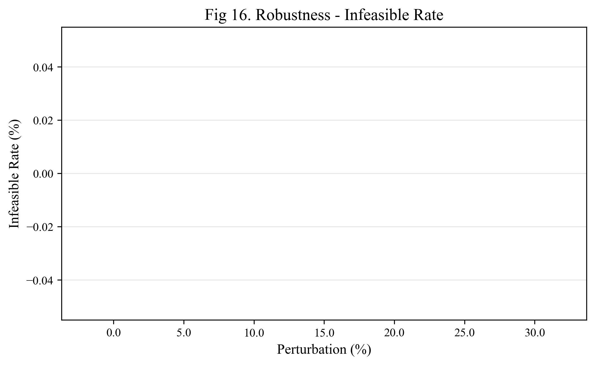
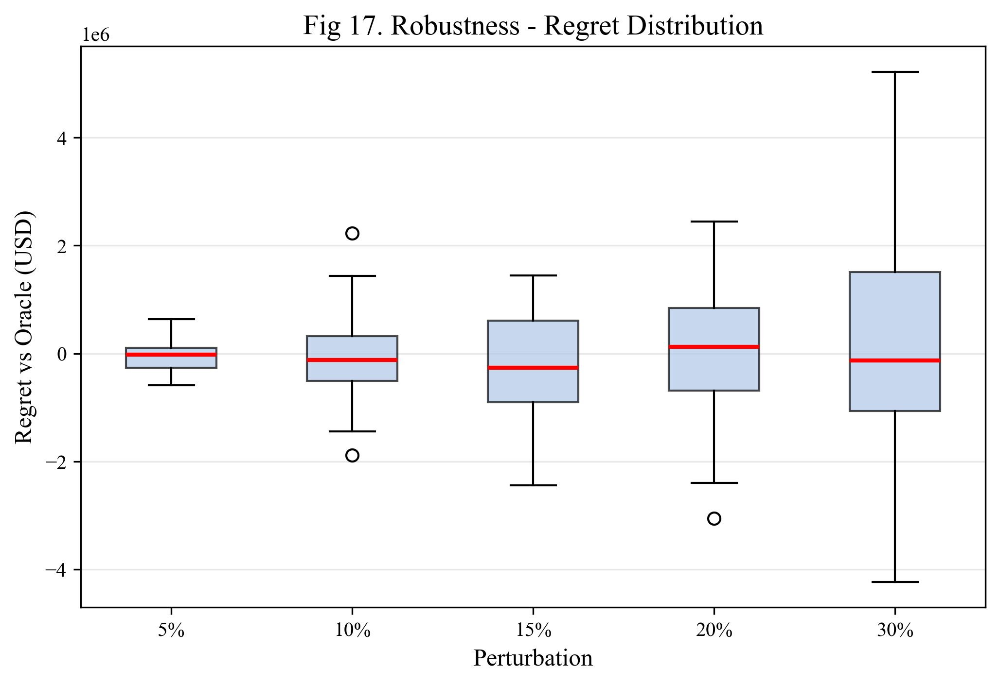
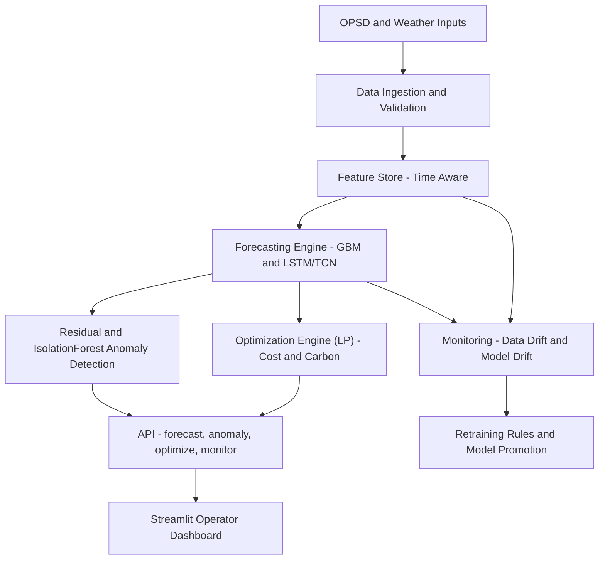
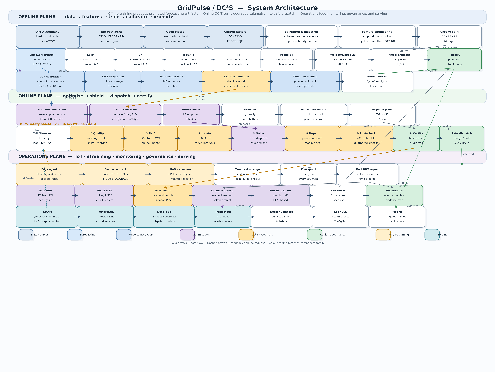

# GridPulse: Autonomous Energy Intelligence & Optimization Platform


GridPulse is an end‑to‑end energy intelligence platform for modern electrical grids. It ingests power‑system and weather data, forecasts load and renewables, detects anomalies, and optimizes dispatch under cost and carbon objectives. The system includes MLOps monitoring and a Streamlit operator dashboard.

## Results Snapshot


## Latest Run Summary
- **Run Date:** February 2026
- **Dataset:** OPSD Germany (hourly load, wind, solar, price, carbon)
- **Carbon signal:** SMARD hourly (2015–2020)
- **Models trained:** GBM (LightGBM), LSTM, TCN — per target
- **Optimization:** LP dispatch with battery (20 GWh / 5 GW), cost + carbon objectives

---

## Publication Figures

### Forecasting Performance

#### Fig 1–3. Forecast vs Actual (7-Day Window)
| Load | Wind | Solar |
|:---:|:---:|:---:|
|  |  |  |

#### Fig 4. Rolling Backtest RMSE by Week


#### Fig 5. Residual Distribution


#### Fig 6. Seasonality Error Heatmap (Month × Hour)


### Uncertainty Quantification

#### Fig 7. Prediction Intervals — Load (90% Conformal)


#### Fig 8. Coverage by Horizon


#### Fig 9. Interval Width by Horizon


### Anomaly Detection

#### Fig 10. Anomaly Timeline — Load (30 Days)


#### Fig 11. Residual Z-Score Timeline


### Dispatch Optimization

#### Fig 12. Dispatch Comparison (7 Days)


#### Fig 13. Battery SOC Trajectory


#### Fig 14. Impact Savings — GridPulse vs Baseline


#### Fig 15. Cost vs Carbon Trade-Off


### Robustness Analysis

#### Fig 16. Infeasible Rate Under Perturbation


#### Fig 17. Regret Distribution


### Monitoring & Drift

#### Fig 18. Data Drift (KS Test) Over Time


#### Fig 19. Model Drift (GBM RMSE) Over Time


---

## Benchmark Metrics

### Forecast Point Metrics (Test Split)
| Model | Target | RMSE | MAE | sMAPE | MAPE |
|---|---|---:|---:|---:|---:|
| **GBM** | load_mw | 298.60 | 185.94 | 0.0039 | 0.0039 |
| LSTM | load_mw | 4975.17 | 3633.78 | 0.0710 | 0.0690 |
| TCN | load_mw | 6157.08 | 5172.09 | 0.1064 | 0.0993 |
| Persistence | load_mw | 6010.56 | 3901.68 | 0.0783 | 0.0771 |

### Conformal Prediction Intervals (90%)
| Target | PICP | MPIW (MW) | N |
|---|---:|---:|---:|
| load_mw | 0.9517 | 951.22 | 1,739 |
| wind_mw | 0.8815 | 348.72 | 1,739 |
| solar_mw | 0.8700 | 622.67 | 1,739 |

### Impact Summary (7-Day Test Window)
| Metric | Value |
|---|---:|
| Cost savings | **1.35%** ($4.24M) |
| Carbon reduction | **0.13%** (3,476 tonnes CO₂) |

### Robustness (0–30% Forecast Perturbation)
| Perturbation | Infeasible Rate | Mean Regret (USD) |
|---:|---:|---:|
| 0% | 0% | $0 |
| 5% | 0% | −$1,509 |
| 10% | 0% | −$68,064 |
| 15% | 0% | −$137,858 |

---

## Demo


## Architecture





SVG version for reports: `reports/figures/architecture.svg`

**Detailed Flow**
1. **Ingest**: OPSD load/wind/solar, optional weather, and carbon signals land in `data/raw` via `gridpulse.data_pipeline.download_*`.
2. **Validate**: `validate_schema` enforces column presence, timestamps, and missing‑value checks with a human‑readable report at `reports/data_quality_report.md`.
3. **Feature Store**: `build_features` joins signals, weather, holidays, lags, and calendar features into `data/processed/features.parquet`.
4. **Splits**: `split_time_series` writes train/val/test indices to `data/processed/splits` for reproducible backtests.
5. **Forecasting**: `gridpulse.forecasting.train` fits GBM + LSTM/TCN models and saves bundles to `artifacts/models_*` with scalers and metrics.
6. **Anomalies**: residual z‑scores + IsolationForest flag unusual behavior for monitoring and report context.
7. **Optimization**: `gridpulse.optimizer` solves LP dispatch with cost + carbon weights, battery constraints, and peak penalties.
8. **Reporting**: `scripts/build_reports.py` produces impact comparisons, figures, and summary CSVs in `reports/`.
9. **Serving**: `services/api` exposes forecast/optimize endpoints; `services/dashboard` renders operator views.
10. **Monitoring**: `gridpulse.monitoring` tracks drift, alert thresholds, and retraining triggers.
11. **Run Snapshot**: each pipeline run writes `artifacts/runs/<run_id>/manifest.json` plus config copies and `pip_freeze.txt`.

## Core Capabilities
- **Forecasting:** Gradient boosting and deep learning (LSTM/TCN) with 24‑hour horizons and intervals.
- **Anomaly Detection:** Residual z‑scores + Isolation Forest.
- **Optimization:** Linear programming dispatch with battery and grid constraints.
- **MLOps:** Drift monitoring and retraining signals.
- **Product:** Streamlit dashboard for operators.

## Technology Stack
- **Python 3.9+**
- **Data:** Pandas, NumPy, Scikit‑learn, PyArrow
- **Forecasting:** LightGBM/XGBoost, PyTorch
- **API:** FastAPI, Uvicorn
- **UI:** Streamlit
- **Ops:** Docker, Git

## Data Sources
- **Power system data:** Open Power System Data (OPSD) — Germany load/wind/solar time‑series.
- **Weather data (optional):** Open‑Meteo for Berlin hourly features.
- **USA dataset (optional):** EIA Form 930 (hourly balancing‑authority demand + generation).

## Data & Licensing
This repo does **not** store raw datasets. See `DATA.md` for:
- dataset inventory (OPSD, EIA‑930, optional weather),
- expected file locations,
- licensing/attribution notes,
- reproducible download/processing steps.

## Quickstart

### 1) Create environment
```bash
python -m venv .venv
source .venv/bin/activate   # macOS/Linux
pip install -r requirements.txt
```
Exact versions are captured in `requirements.lock.txt` after installation.

### 1b) (Optional) Secrets + runtime settings
Copy `.env.example` to `.env` and fill in tokens if you plan to pull external carbon data (Electricity Maps, WattTime) or enable alerting.

### 2) Run the data pipeline
```bash
python -m gridpulse.data_pipeline.download_opsd --out data/raw
python -m gridpulse.data_pipeline.validate_schema --in data/raw --report reports/data_quality_report.md
python -m gridpulse.data_pipeline.build_features --in data/raw --out data/processed
python -m gridpulse.data_pipeline.split_time_series --in data/processed/features.parquet --out data/processed/splits
```
Or run the full pipeline with caching:
```bash
python -m gridpulse.pipeline.run --all
```

Optional weather ingestion + SQL storage:
```bash
python -m gridpulse.data_pipeline.download_weather --out data/raw --start 2017-01-01 --end 2020-12-31
python -m gridpulse.data_pipeline.build_features --in data/raw --out data/processed \
  --weather data/raw/weather_berlin_hourly.csv \
  --sql-out data/processed/gridpulse.duckdb --sql-engine duckdb
```

Optional price + carbon signals (recommended for realistic impact metrics):
```bash
python -m gridpulse.data_pipeline.build_features --in data/raw --out data/processed \
  --signals data/raw/price_carbon_signals.csv
```

Electricity Maps carbon intensity (real data):
```bash
export ELECTRICITYMAPS_TOKEN=...
python scripts/download_emaps_carbon.py \
  --zone <zone_code> \
  --start 2020-01-01T00:00:00Z \
  --end 2020-12-31T23:00:00Z \
  --out data/raw/carbon_signals.csv
# Or prepare from a CSV export:
python scripts/prepare_emaps_carbon.py \
  --in data/raw/electricitymaps_carbon.csv \
  --timestamp-col <timestamp_col_from_csv> \
  --carbon-col <carbon_col_from_csv> \
  --unit gco2_kwh \
  --zone-col <zone_col> --zone <zone_code> \
  --out data/raw/carbon_signals.csv
```

SMARD hourly carbon intensity (Germany, no token):
```bash
python scripts/download_smard_carbon.py \
  --region DE \
  --start 2015-01-01T00:00:00Z \
  --end 2020-09-30T23:00:00Z \
  --out data/raw/carbon_signals.csv \
  --factors configs/carbon_factors.yaml
```

WattTime marginal emissions (MOER):
```bash
export WATTTIME_USERNAME=... WATTTIME_PASSWORD=...
python scripts/download_watttime_moer.py \
  --region CAISO_NORTH \
  --start 2020-01-01T00:00:00Z \
  --end 2020-12-31T23:00:00Z \
  --out data/raw/moer_signals.csv
python scripts/merge_signals.py \
  --carbon data/raw/carbon_signals.csv \
  --moer data/raw/moer_signals.csv \
  --out data/raw/price_carbon_signals.csv
```

### 3) Train forecasting models (GBM + LSTM + TCN)
```bash
python -m gridpulse.forecasting.train --config configs/train_forecast.yaml
```

### Full training + figures (one command)
```bash
./scripts/train_full.sh
```

### Optional: Train both OPSD + USA EIA930
```bash
python scripts/train_multi_dataset.py --ba MISO
```

### Optional: Generate reports for EIA930
```bash
python scripts/build_reports.py \
  --features data/processed/us_eia930/features.parquet \
  --splits data/processed/us_eia930/splits \
  --models-dir artifacts/models_eia930 \
  --reports-dir reports/eia930
```

Training outputs include RMSE, MAE, MAPE, sMAPE, and daylight‑MAPE for solar. A walk‑forward report is optionally generated at `reports/walk_forward_report.json`.

### Impact benchmark (evidence‑backed claims)
Impact metrics are generated by `scripts/build_reports.py` using the optimization config. If price signals are missing, cost savings will be near zero. To update the README table:
```bash
python scripts/build_reports.py
python scripts/update_readme_impact.py
```

## Reproducibility
- **Fixed seed:** `configs/train_forecast.yaml` includes `seed: 42` (override as needed).
- **Deterministic training:** seeds are applied to Python, NumPy, and PyTorch.
- **Exact steps:** use `notebooks/13_runbook_end_to_end.ipynb` for a full end‑to‑end run.
- **Version locks:** `requirements.lock.txt` captures installed versions.
- **Pipeline cache:** `.cache/pipeline.json` tracks hashes to skip unchanged steps.
- **Scaled training:** LSTM/TCN training applies feature + target scaling for stability; scalers are stored in model bundles and used at inference time.
- **Run snapshot:** each pipeline run writes `artifacts/runs/<run_id>/manifest.json`, config copies, and `pip_freeze.txt`.

Reproducible one‑command run:
```bash
./scripts/repro_run.sh
```

## Reports
- `reports/formal_evaluation_report.md` — 1‑page evaluation summary with plots.
- `reports/model_cards/` — per‑target model cards.
- `reports/multi_horizon_backtest.json` — multi‑horizon backtest results.
- `reports/rolling_backtest.md` — rolling weekly backtest with confidence intervals.
- `reports/impact_comparison.md` — baseline vs optimized dispatch impact (cost + carbon).
- `reports/impact_summary.csv` — summary metrics for README (auto‑updated).
- `reports/case_study.md` — end‑to‑end case study with failure‑day analysis.
- `reports/anomaly_report.md` — anomaly detection summary with timeline figures.
- `reports/decision_robustness.md` — dispatch robustness under forecast uncertainty.
- `reports/forecast_intervals.md` — conformal prediction interval evaluation.
- `reports/figures/` — **19 publication-quality figures** (300 DPI PNGs).
- `reports/tables/` — data coverage, missingness, dispatch KPIs by day.
- `reports/metrics/` — forecast point/window metrics, intervals, robustness, runtime.
- `scripts/build_reports.py` — regenerate reports/figures after training.
- `scripts/generate_publication_figures.py` — generate all 19 publication figures + 9 CSV tables.

### 4) Start API
```bash
uvicorn services.api.main:app --reload --port 8000
```

### 5) Start dashboard
```bash
streamlit run services/dashboard/app.py
```

### 5b) Start API + dashboard together (optional)
```bash
./scripts/run_all.sh
```

### 6) Monitor + Optimize (API)
```bash
curl http://localhost:8000/monitor
curl -X POST http://localhost:8000/optimize \
  -H 'Content-Type: application/json' \
  -d '{"forecast_load_mw":[8000,8200],"forecast_renewables_mw":[3200,3100]}'
```

## Notebooks
- `notebooks/01_eda.ipynb` — dataset inspection
- `notebooks/02_baselines.ipynb` — baseline evaluation
- `notebooks/03_feature_pipeline.ipynb` — data pipeline
- `notebooks/04_train_models.ipynb` — GBM/LSTM/TCN training
- `notebooks/05_inference_intervals.ipynb` — forecast + intervals
- `notebooks/06_error_analysis.ipynb` — residual analysis
- `notebooks/07_production_run.ipynb` — end‑to‑end runbook
- `notebooks/08_weather_features.ipynb` — optional weather features
- `notebooks/09_walk_forward_report.ipynb` — backtest visualization
- `notebooks/10_optimization_engine.ipynb` — optimization + dispatch plots
- `notebooks/11_monitoring_drift.ipynb` — drift checks + retraining decision
- `notebooks/12_api_dashboard_smoke_test.ipynb` — API health + endpoint checks
- `notebooks/13_runbook_end_to_end.ipynb` — full pipeline runbook

## Repo Layout
- `src/gridpulse/` — core library (data pipeline, forecasting, anomaly, optimizer, monitoring)
- `services/api/` — FastAPI service
- `services/dashboard/` — Streamlit app
- `configs/` — YAML configs
- `notebooks/` — EDA and training notebooks
- `data/` — raw/interim/processed datasets (git‑ignored)
- `artifacts/` — models and backtests (git‑ignored)
- `reports/` — reports (git‑ignored)

## Configs
- `configs/train_forecast.yaml` — training configuration (seed, models, horizons).
- `configs/forecast.yaml` — inference model bundle paths.
- `configs/optimization.yaml` — dispatch cost/carbon/battery constraints.

## License
MIT (edit if your program requires otherwise).
