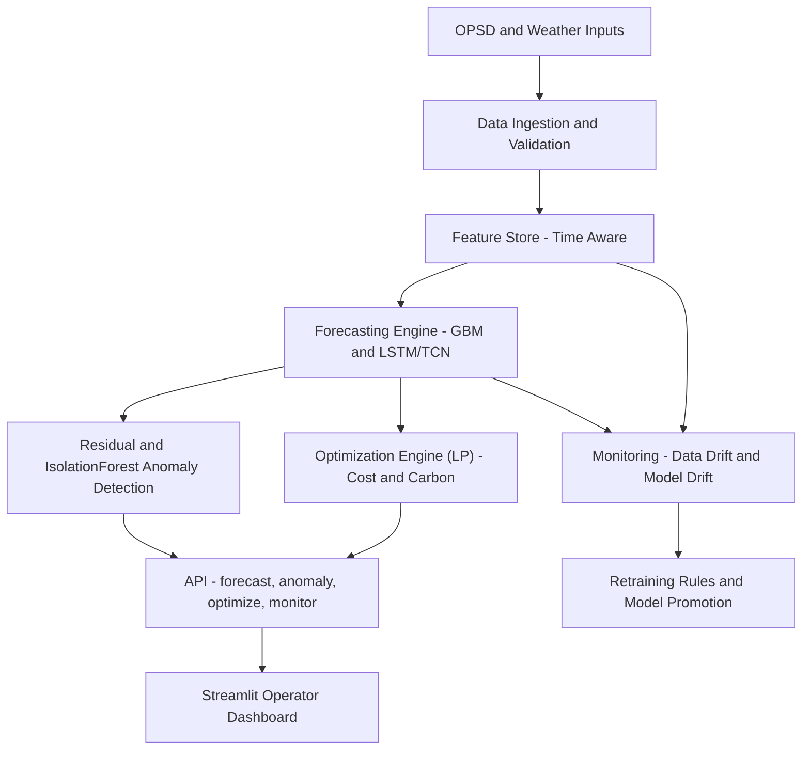

# GridPulse: Autonomous Energy Intelligence & Optimization Platform


GridPulse is an end‑to‑end energy intelligence platform for modern electrical grids. It ingests power‑system and weather data, forecasts load and renewables, detects anomalies, and optimizes dispatch under cost and carbon objectives. The system includes MLOps monitoring and a Streamlit operator dashboard.

## Architecture



## Core Capabilities
- **Forecasting:** Gradient boosting and deep learning (LSTM/TCN) with 24‑hour horizons and intervals.
- **Anomaly Detection:** Residual z‑scores + Isolation Forest.
- **Optimization:** Linear programming dispatch with battery and grid constraints.
- **MLOps:** Drift monitoring and retraining signals.
- **Product:** Streamlit dashboard for operators.

## Technology Stack
- **Python 3.9+**
- **Data:** Pandas, NumPy, Scikit‑learn, PyArrow
- **Forecasting:** LightGBM/XGBoost, PyTorch
- **API:** FastAPI, Uvicorn
- **UI:** Streamlit
- **Ops:** Docker, Git

## Quickstart

### 1) Create environment
```bash
python -m venv .venv
source .venv/bin/activate   # macOS/Linux
pip install -r requirements.txt
```

### 2) Run the data pipeline
```bash
python -m gridpulse.data_pipeline.download_opsd --out data/raw
python -m gridpulse.data_pipeline.validate_schema --in data/raw --report reports/data_quality_report.md
python -m gridpulse.data_pipeline.build_features --in data/raw --out data/processed
python -m gridpulse.data_pipeline.split_time_series --in data/processed/features.parquet --out data/processed/splits
```

Optional weather ingestion + SQL storage:
```bash
python -m gridpulse.data_pipeline.download_weather --out data/raw --start 2017-01-01 --end 2020-12-31
python -m gridpulse.data_pipeline.build_features --in data/raw --out data/processed \
  --weather data/raw/weather_berlin_hourly.csv \
  --sql-out data/processed/gridpulse.duckdb --sql-engine duckdb
```

### 3) Train forecasting models (GBM + LSTM + TCN)
```bash
python -m gridpulse.forecasting.train --config configs/train_forecast.yaml
```

Training outputs include RMSE, MAE, MAPE, sMAPE, and daylight‑MAPE for solar. A walk‑forward report is optionally generated at `reports/walk_forward_report.json`.

### 4) Start API
```bash
uvicorn services.api.main:app --reload --port 8000
```

### 5) Start dashboard
```bash
streamlit run services/dashboard/app.py
```

### 6) Monitor + Optimize (API)
```bash
curl http://localhost:8000/monitor
curl -X POST http://localhost:8000/optimize \
  -H 'Content-Type: application/json' \
  -d '{"forecast_load_mw":[8000,8200],"forecast_renewables_mw":[3200,3100]}'
```

## Notebooks
- `notebooks/01_eda.ipynb` — dataset inspection
- `notebooks/02_baselines.ipynb` — baseline evaluation
- `notebooks/03_feature_pipeline.ipynb` — data pipeline
- `notebooks/04_train_models.ipynb` — GBM/LSTM/TCN training
- `notebooks/05_inference_intervals.ipynb` — forecast + intervals
- `notebooks/06_error_analysis.ipynb` — residual analysis
- `notebooks/07_production_run.ipynb` — end‑to‑end runbook
- `notebooks/08_weather_features.ipynb` — optional weather features

## Repo Layout
- `src/gridpulse/` — core library (data pipeline, forecasting, anomaly, optimizer, monitoring)
- `services/api/` — FastAPI service
- `services/dashboard/` — Streamlit app
- `configs/` — YAML configs
- `notebooks/` — EDA and training notebooks
- `data/` — raw/interim/processed datasets (git‑ignored)
- `artifacts/` — models and backtests (git‑ignored)
- `reports/` — reports (git‑ignored)

## License
MIT (edit if your program requires otherwise).
