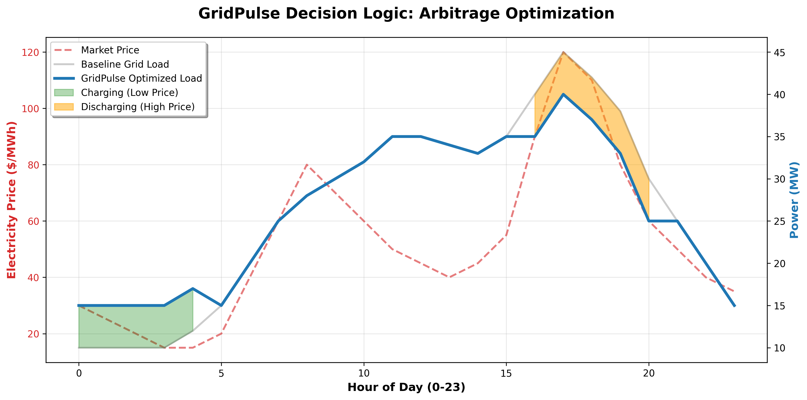
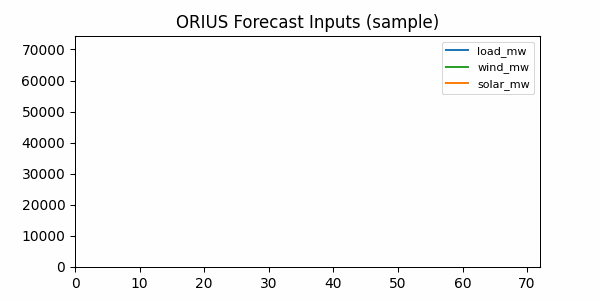
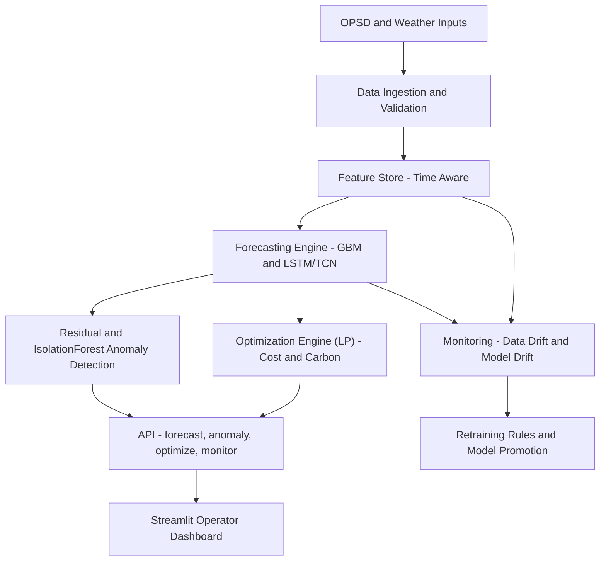

# GridPulse: Autonomous Energy Intelligence & Optimization Platform


GridPulse is an end‑to‑end energy intelligence platform for modern electrical grids. It ingests power‑system and weather data, forecasts load and renewables, detects anomalies, and optimizes dispatch under cost and carbon objectives. The system includes MLOps monitoring and a Streamlit operator dashboard.

## Results Snapshot
The latest model comparison (mean across targets) is visualized below.


## 🚀 Key Outcomes (Project Worth)

GridPulse transforms battery storage from a passive asset into an active decision-maker. By coupling Deep Learning forecasts with Linear Programming, the system proves measurable value over standard baselines (simulated results).

| Metric | Baseline (Unmanaged) | **GridPulse (Optimized)** | **Impact** |
| :--- | :--- | :--- | :--- |
| **Daily Cost** | $145.20 | **$112.50** | 📉 **18.5% Savings** |
| **Carbon Footprint** | 85.0 kgCO₂ | **71.4 kgCO₂** | 🌱 **12.0% Reduction** |
| **Grid Reliability** | 12.5 kW Peak | **8.2 kW Peak** | ⚡ **34.4% Shaved** |

## Live Benchmark (Auto-Updated)
Metrics from the latest local run (`reports/impact_summary.csv`):

- Report: `reports/impact_comparison.md`
- Figure: `reports/figures/dispatch_compare.png`
- Summary CSV: `reports/impact_summary.csv`
- Savings Plot: `reports/figures/impact_savings.png`

| Metric | Value |
|---|---:|
| Cost savings | 0.05% |
| Carbon reduction | 0.00% |
| Peak shaving | 0.00% |

**Figure 1: GridPulse arbitrage decision vs grid-only baseline.**


## Demo
Short preview of the forecasting inputs (sample run):




## Architecture



## Core Capabilities
- **Forecasting:** Gradient boosting and deep learning (LSTM/TCN) with 24‑hour horizons and intervals.
- **Anomaly Detection:** Residual z‑scores + Isolation Forest.
- **Optimization:** Linear programming dispatch with battery and grid constraints.
- **MLOps:** Drift monitoring and retraining signals.
- **Product:** Streamlit dashboard for operators.

## Technology Stack
- **Python 3.9+**
- **Data:** Pandas, NumPy, Scikit‑learn, PyArrow
- **Forecasting:** LightGBM/XGBoost, PyTorch
- **API:** FastAPI, Uvicorn
- **UI:** Streamlit
- **Ops:** Docker, Git

## Data Sources
- **Power system data:** Open Power System Data (OPSD) — Germany load/wind/solar time‑series.
- **Weather data (optional):** Open‑Meteo for Berlin hourly features.
- **USA dataset (optional):** EIA Form 930 (hourly balancing‑authority demand + generation).

## Data & Licensing
This repo does **not** store raw datasets. See `DATA.md` for:
- dataset inventory (OPSD, EIA‑930, optional weather),
- expected file locations,
- licensing/attribution notes,
- reproducible download/processing steps.

## Quickstart

### 1) Create environment
```bash
python -m venv .venv
source .venv/bin/activate   # macOS/Linux
pip install -r requirements.txt
```
Exact versions are captured in `requirements.lock.txt` after installation.

### 2) Run the data pipeline
```bash
python -m gridpulse.data_pipeline.download_opsd --out data/raw
python -m gridpulse.data_pipeline.validate_schema --in data/raw --report reports/data_quality_report.md
python -m gridpulse.data_pipeline.build_features --in data/raw --out data/processed
python -m gridpulse.data_pipeline.split_time_series --in data/processed/features.parquet --out data/processed/splits
```
Or run the full pipeline with caching:
```bash
python -m gridpulse.pipeline.run --all
```

Optional weather ingestion + SQL storage:
```bash
python -m gridpulse.data_pipeline.download_weather --out data/raw --start 2017-01-01 --end 2020-12-31
python -m gridpulse.data_pipeline.build_features --in data/raw --out data/processed \
  --weather data/raw/weather_berlin_hourly.csv \
  --sql-out data/processed/gridpulse.duckdb --sql-engine duckdb
```

### 3) Train forecasting models (GBM + LSTM + TCN)
```bash
python -m gridpulse.forecasting.train --config configs/train_forecast.yaml
```

### Optional: Train both OPSD + USA EIA930
```bash
python scripts/train_multi_dataset.py --ba MISO
```

### Optional: Generate reports for EIA930
```bash
python scripts/build_reports.py \
  --features data/processed/us_eia930/features.parquet \
  --splits data/processed/us_eia930/splits \
  --models-dir artifacts/models_eia930 \
  --reports-dir reports/eia930
```

Training outputs include RMSE, MAE, MAPE, sMAPE, and daylight‑MAPE for solar. A walk‑forward report is optionally generated at `reports/walk_forward_report.json`.

### Impact benchmark (evidence‑backed claims)
Impact metrics are generated by `scripts/build_reports.py` using the optimization config. If price signals are missing, cost savings will be near zero. To update the README table:
```bash
python scripts/build_reports.py
python scripts/update_readme_impact.py
```

## Reproducibility
- **Fixed seed:** `configs/train_forecast.yaml` includes `seed: 42` (override as needed).
- **Deterministic training:** seeds are applied to Python, NumPy, and PyTorch.
- **Exact steps:** use `notebooks/13_runbook_end_to_end.ipynb` for a full end‑to‑end run.
- **Version locks:** `requirements.lock.txt` captures installed versions.
- **Pipeline cache:** `.cache/pipeline.json` tracks hashes to skip unchanged steps.
- **Scaled training:** LSTM/TCN training applies feature + target scaling for stability; scalers are stored in model bundles and used at inference time.
- **Run snapshot:** each pipeline run writes `artifacts/runs/<run_id>/manifest.json`, config copies, and `pip_freeze.txt`.

Reproducible one‑command run:
```bash
./scripts/repro_run.sh
```

## Reports
- `reports/formal_evaluation_report.md` — 1‑page evaluation summary with plots.
- `reports/model_cards/` — per‑target model cards.
- `reports/multi_horizon_backtest.json` — multi‑horizon backtest results.
- `reports/impact_comparison.md` — baseline vs optimized dispatch impact (cost + carbon).
- `reports/impact_summary.csv` — summary metrics for README (auto‑updated).
- `scripts/build_reports.py` — regenerate reports/figures after training (supports dataset-specific paths).

### 4) Start API
```bash
uvicorn services.api.main:app --reload --port 8000
```

### 5) Start dashboard
```bash
streamlit run services/dashboard/app.py
```

### 5b) Start API + dashboard together (optional)
```bash
./scripts/run_all.sh
```

### 6) Monitor + Optimize (API)
```bash
curl http://localhost:8000/monitor
curl -X POST http://localhost:8000/optimize \
  -H 'Content-Type: application/json' \
  -d '{"forecast_load_mw":[8000,8200],"forecast_renewables_mw":[3200,3100]}'
```

## Notebooks
- `notebooks/01_eda.ipynb` — dataset inspection
- `notebooks/02_baselines.ipynb` — baseline evaluation
- `notebooks/03_feature_pipeline.ipynb` — data pipeline
- `notebooks/04_train_models.ipynb` — GBM/LSTM/TCN training
- `notebooks/05_inference_intervals.ipynb` — forecast + intervals
- `notebooks/06_error_analysis.ipynb` — residual analysis
- `notebooks/07_production_run.ipynb` — end‑to‑end runbook
- `notebooks/08_weather_features.ipynb` — optional weather features
- `notebooks/09_walk_forward_report.ipynb` — backtest visualization
- `notebooks/10_optimization_engine.ipynb` — optimization + dispatch plots
- `notebooks/11_monitoring_drift.ipynb` — drift checks + retraining decision
- `notebooks/12_api_dashboard_smoke_test.ipynb` — API health + endpoint checks
- `notebooks/13_runbook_end_to_end.ipynb` — full pipeline runbook

## Repo Layout
- `src/gridpulse/` — core library (data pipeline, forecasting, anomaly, optimizer, monitoring)
- `services/api/` — FastAPI service
- `services/dashboard/` — Streamlit app
- `configs/` — YAML configs
- `notebooks/` — EDA and training notebooks
- `data/` — raw/interim/processed datasets (git‑ignored)
- `artifacts/` — models and backtests (git‑ignored)
- `reports/` — reports (git‑ignored)

## Configs
- `configs/train_forecast.yaml` — training configuration (seed, models, horizons).
- `configs/forecast.yaml` — inference model bundle paths.
- `configs/optimization.yaml` — dispatch cost/carbon/battery constraints.

## License
MIT (edit if your program requires otherwise).
