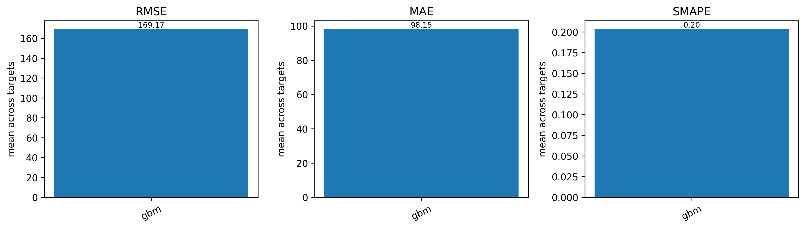
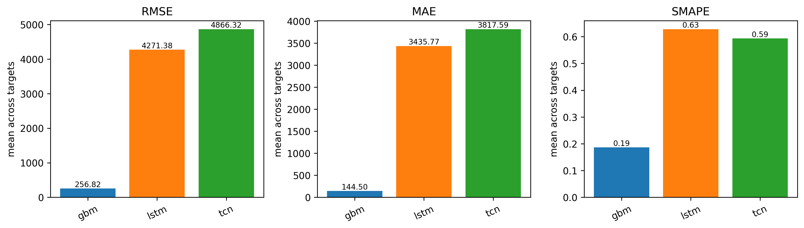
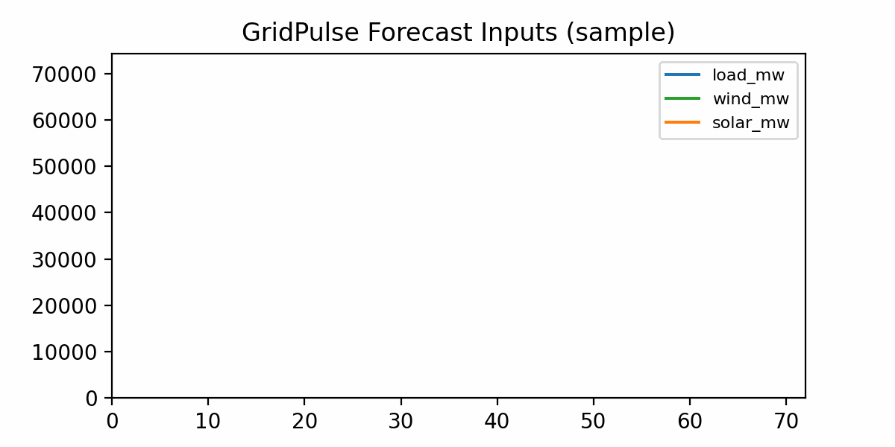
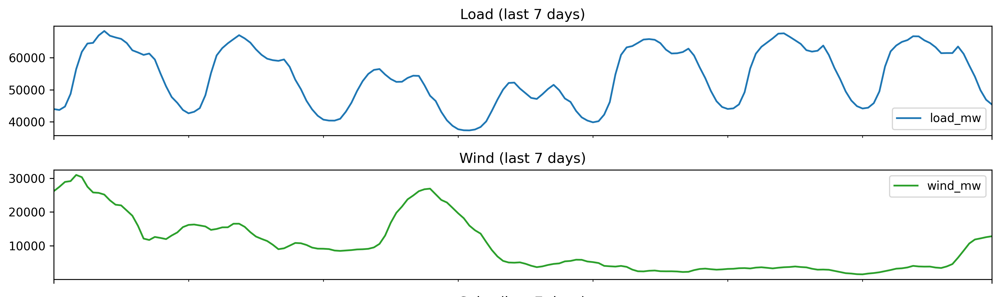
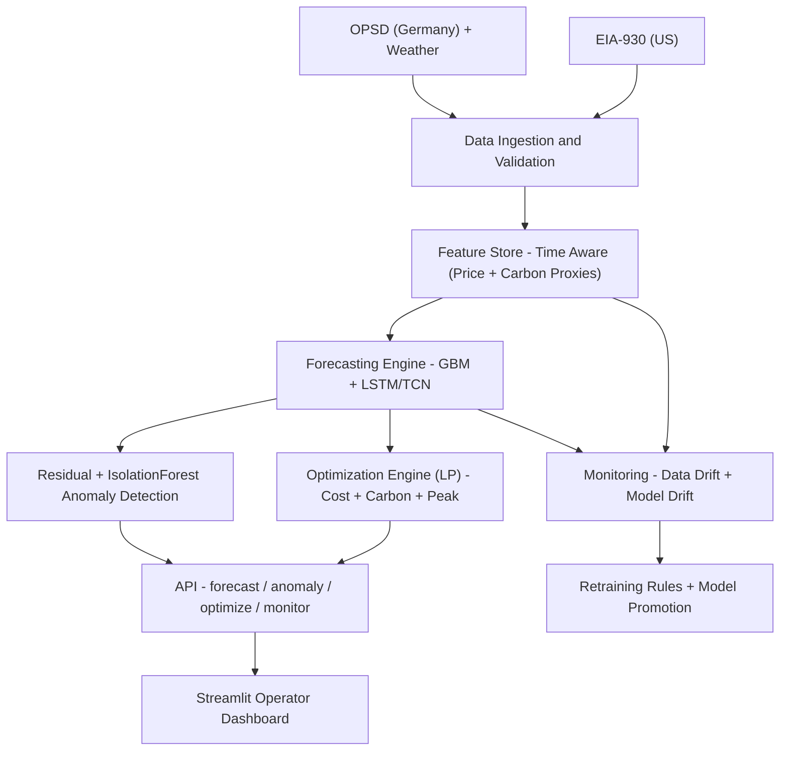

# GridPulse: Autonomous Energy Intelligence & Optimization Platform


GridPulse is an end‑to‑end energy intelligence platform for modern electrical grids. It ingests power‑system and weather data, forecasts load and renewables, detects anomalies, and optimizes dispatch under cost, carbon, and peak‑shaving objectives. The system includes monitoring, reproducible pipelines, and a Streamlit operator dashboard.

## What this project does
- **Forecasts** load, wind, and solar (GBM + LSTM/TCN).
- **Flags anomalies** with residual checks + Isolation Forest.
- **Optimizes dispatch** with a physics‑constrained LP (battery SoC, power, grid caps).
- **Quantifies impact** vs baseline policies (cost, carbon, peak shaving).
- **Serves results** via FastAPI + Streamlit.

## Datasets
- **OPSD Germany**: load/wind/solar; optional day‑ahead price.
- **EIA‑930 (US)**: balancing‑authority demand + generation (e.g., MISO).
- **Optional weather**: Open‑Meteo (Berlin hourly features).

This repo does **not** store raw datasets. See `DATA.md` for locations, licensing, and download steps.

## Docs
- `docs/ARCHITECTURE.md` — system diagram + layers
- `docs/RUNBOOK.md` — end-to-end commands (OPSD + EIA-930)
- `docs/EVALUATION.md` — metrics, baselines, impact evaluation

## Technology stack
- **Python 3.9+**
- **Data:** Pandas, NumPy, Scikit‑learn, PyArrow
- **Forecasting:** LightGBM, PyTorch (LSTM/TCN)
- **API:** FastAPI, Uvicorn
- **UI:** Streamlit
- **Ops:** Docker, Git

## Key outcomes (evidence‑backed)
GridPulse compares optimized dispatch against a **grid‑only baseline** and a **naive battery policy** to quantify cost, carbon, and peak‑shaving impact.

- OPSD report: `reports/impact_comparison.md`
- EIA‑930 report: `reports/eia930/impact_comparison.md`
- Savings plots: `reports/figures/impact_savings.png`, `reports/eia930/figures/impact_savings.png`

### Impact table (OPSD – last generated)
Update after each benchmark:
```bash
python scripts/update_readme_impact.py
```

| Metric | Value |
|---|---:|
| Cost savings | 0.05% |
| Carbon reduction | 0.00% |
| Peak shaving | 0.00% |

### Impact table (EIA‑930 – last generated)
Values are from `reports/eia930/impact_summary.csv`.

| Metric | EIA‑930 Value |
|---|---:|
| Cost savings | 0.03% |
| Carbon reduction | 0.00% |
| Peak shaving | 0.00% |

**Arbitrage visualization**


## Results snapshot
**OPSD (Germany) model comparison**



**EIA‑930 (US) model comparison**



## Demo





## Professional architecture (Level‑4)
GridPulse is a **decision‑grade** system: predictions → decisions → measured impact.



### Architecture layers
1. **Data ingestion + validation** (OPSD/EIA‑930 + optional weather)
2. **Time‑aware feature store** (lags, rolls, price + carbon proxies)
3. **Forecasting layer** (GBM + LSTM/TCN, 24h horizon)
4. **Reliability layer** (residuals + anomaly flags)
5. **Decision layer** (LP dispatch with SoC, power, grid caps)
6. **Impact layer** (baseline comparison: cost/carbon/peak)
7. **Monitoring + product layer** (drift checks, API, dashboard)

## Quickstart

### Repro in 5 commands
```bash
python -m venv .venv
source .venv/bin/activate
pip install -r requirements.txt
python -m gridpulse.pipeline.run --all
python scripts/build_reports.py
```


### 1) Environment
```bash
python -m venv .venv
source .venv/bin/activate   # macOS/Linux
pip install -r requirements.txt
```
Exact versions are captured in `requirements.lock.txt` after installation.

### 2) OPSD pipeline (Germany)
```bash
python -m gridpulse.data_pipeline.download_opsd --out data/raw
python -m gridpulse.data_pipeline.validate_schema --in data/raw --report reports/data_quality_report.md
python -m gridpulse.data_pipeline.build_features --in data/raw --out data/processed
python -m gridpulse.data_pipeline.split_time_series --in data/processed/features.parquet --out data/processed/splits
```

### 3) EIA‑930 pipeline (US)
```bash
python -m gridpulse.data_pipeline.build_features_eia930 \
  --in data/raw/us_eia930 \
  --out data/processed/us_eia930 \
  --ba MISO

python -m gridpulse.data_pipeline.split_time_series \
  --in data/processed/us_eia930/features.parquet \
  --out data/processed/us_eia930/splits
```

### 4) Train forecasting models
```bash
python -m gridpulse.forecasting.train --config configs/train_forecast.yaml
```

### 5) Generate reports
```bash
python scripts/build_reports.py
```

EIA‑930 reports:
```bash
python scripts/build_reports.py \
  --features data/processed/us_eia930/features.parquet \
  --splits data/processed/us_eia930/splits \
  --models-dir artifacts/models_eia930 \
  --reports-dir reports/eia930
```

### 6) API + dashboard
```bash
uvicorn services.api.main:app --reload --port 8000
streamlit run services/dashboard/app.py
```

### Makefile shortcuts
```bash
make setup
make data
make train
make reports
make monitor
make api
make dashboard
make release_check
```

## Reproducibility
- **Fixed seed** in training config.
- **Deterministic runs** (Python/NumPy/PyTorch seeds applied).
- **Exact runbook** in `notebooks/13_runbook_end_to_end.ipynb`.
- **Version locks** in `requirements.lock.txt`.
- **Run snapshots** in `artifacts/runs/<run_id>/`.

One‑command run:
```bash
./scripts/repro_run.sh
```

## Production readiness checklist
✅ **Reproducibility**
- [ ] Fresh install works from README
- [ ] Fixed seeds, config files used

✅ **Correctness**
- [ ] Leakage‑safe time split verified
- [ ] Metrics stable (solar uses sMAPE/daylight MAPE)
- [ ] Optimization constraints validated (`reports/dispatch_validation.md`)

✅ **Reliability**
- [ ] API health check passes (`scripts/check_api_health.py`)
- [ ] Errors handled gracefully

✅ **Observability**
- [ ] Data drift report produced (`reports/monitoring_report.md`)
- [ ] Model drift report produced (in monitoring payload)
- [ ] Run artifacts saved

✅ **Product**
- [ ] Streamlit dashboard demo works
- [ ] Screenshots/video included

✅ **Documentation**
- [ ] README Quickstart
- [ ] DATA.md for datasets
- [ ] Architecture diagram

Release gate (runs tests + monitoring + reports):
```bash
make release_check
```

## Reports and notebooks
- `reports/formal_evaluation_report.md` — 1‑page evaluation summary.
- `reports/model_cards/` — per‑target model cards.
- `reports/multi_horizon_backtest.json` — multi‑horizon backtest.
- `reports/impact_comparison.md` — baseline vs optimized dispatch impact.
- `reports/impact_summary.csv` — summary metrics for README.
- `reports/eia930/` — EIA‑930 equivalents.

Notebooks:
- `notebooks/01_eda.ipynb` — dataset inspection
- `notebooks/02_baselines.ipynb` — baseline evaluation
- `notebooks/03_feature_pipeline.ipynb` — data pipeline
- `notebooks/04_train_models.ipynb` — GBM/LSTM/TCN training
- `notebooks/05_inference_intervals.ipynb` — forecast + intervals
- `notebooks/06_error_analysis.ipynb` — residual analysis
- `notebooks/07_production_run.ipynb` — end‑to‑end runbook
- `notebooks/08_weather_features.ipynb` — optional weather features
- `notebooks/09_walk_forward_report.ipynb` — backtest visualization
- `notebooks/10_optimization_engine.ipynb` — optimization + dispatch plots
- `notebooks/11_monitoring_drift.ipynb` — drift checks + retraining decision
- `notebooks/12_api_dashboard_smoke_test.ipynb` — API health + endpoint checks
- `notebooks/13_runbook_end_to_end.ipynb` — full pipeline runbook

## Repo layout
- `src/gridpulse/` — core library (data, forecasting, anomaly, optimizer, monitoring)
- `services/api/` — FastAPI service
- `services/dashboard/` — Streamlit app
- `configs/` — YAML configs
- `notebooks/` — EDA and training notebooks
- `data/` — raw/interim/processed datasets (git‑ignored)
- `artifacts/` — models and backtests (git‑ignored)
- `reports/` — generated reports and figures

## License
MIT (edit if your program requires otherwise).
