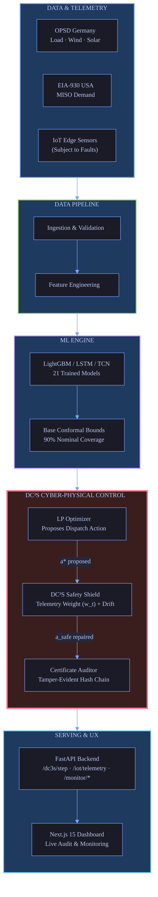

# GridPulse: Safe Streaming Control under Telemetry Degradation via DC³S

GridPulse is an end-to-end cyber-physical control system for safe battery dispatch under degraded IoT telemetry. It introduces DC³S (Drift-Calibrated Conformal Safety Shield) and implements a safety-gated decision loop: **Forecast -> Optimize -> DC3S Shield -> Dispatch -> Audit**.

## Core Contributions
- **DC³S Method**: A reliability-weighted safety shield that inflates conformal uncertainty intervals online using telemetry reliability (`w_t`) and drift signals.
- **CPSBench-IoT**: A reproducible benchmark suite for evaluating controller behavior under deterministic telemetry faults.
- **Runtime Validation**: Sub-10ms model/solver runtime on benchmark hardware is observed in software-in-the-loop profiling (`reports/runtime_benchmark.json`); field hardware commissioning remains pending in the current evidence lock.
- **Strict MLOps Governance**: 21 trained models across Germany OPSD and US EIA-930, with publication-facing claims locked through `paper/metrics_manifest.json` and validator tooling.
- **Explicit Guarantee Contract**: Runtime guarantee checks and assumptions are versioned and auditable (`docs/ASSUMPTIONS_AND_GUARANTEES.md`, certificate `assumptions_version`).

## Table of Contents
- [Reproducing the Paper](#reproducing-the-paper)
- [Architecture](#architecture)
- [Safety under Telemetry Degradation (CPSBench-IoT)](#safety-under-telemetry-degradation-cpsbench-iot)
- [Baseline Economic Impact (Unfaulted Regime)](#baseline-economic-impact-unfaulted-regime)
- [Trained Models & Dashboard](#trained-models--dashboard)
- [Citation](#citation)
- [License](#license)

## Reproducing the Paper
The repository enforces artifact-locked reproducibility for publication-facing metrics and tables.

```bash
# 1. Setup environment
python -m venv .venv && source .venv/bin/activate
pip install -r requirements.txt

# 2. Reproduce CPSBench-IoT publication artifacts
make cpsbench

# 3. Run software-in-the-loop IoT simulation
make iot-sim

# 4. Run one-step DC3S projection and audit certificate flow
make dc3s-demo
```

## Architecture

```mermaid
%%{init: {
  'theme': 'base',
  'themeVariables': {
    'primaryColor': '#1a1b26',
    'primaryTextColor': '#c0caf5',
    'primaryBorderColor': '#7aa2f7',
    'lineColor': '#7aa2f7',
    'secondaryColor': '#24283b',
    'tertiaryColor': '#1a1b26',
    'fontFamily': 'Inter, system-ui, sans-serif',
    'fontSize': '14px'
  }
}}%%

flowchart TB
  subgraph sources["DATA & TELEMETRY"]
    direction LR
    A1["OPSD Germany<br/>Load · Wind · Solar"]
    A2["EIA-930 USA<br/>MISO Demand"]
    A3["IoT Edge Sensors<br/>(Subject to Faults)"]
  end

  subgraph pipeline["DATA PIPELINE"]
    direction TB
    B["Ingestion & Validation"]
    C["Feature Engineering"]
    B --> C
  end

  subgraph ml["ML ENGINE"]
    direction TB
    E["LightGBM / LSTM / TCN<br/>21 Trained Models"]
    G["Base Conformal Bounds<br/>90% Nominal Coverage"]
    E --> G
  end

  subgraph ops["DC³S CYBER-PHYSICAL CONTROL"]
    direction TB
    I["LP Optimizer<br/>Proposes Dispatch Action"]
    S["DC³S Safety Shield<br/>Telemetry Weight (w_t) + Drift"]
    A["Certificate Auditor<br/>Tamper-Evident Hash Chain"]
    I -->|a* proposed| S
    S -->|a_safe repaired| A
  end

  subgraph serve["SERVING & UX"]
    direction TB
    K["FastAPI Backend<br/>/dc3s/step · /iot/telemetry · /monitor/*"]
    L["Next.js 15 Dashboard<br/>Live Audit & Monitoring"]
    K --> L
  end

  sources --> pipeline
  pipeline --> ml
  ml --> ops
  ops --> serve

  style sources fill:#1e3a5f,stroke:#7aa2f7,stroke-width:2px,color:#c0caf5
  style pipeline fill:#1e3a5f,stroke:#9ece6a,stroke-width:2px,color:#c0caf5
  style ml fill:#1e3a5f,stroke:#bb9af7,stroke-width:2px,color:#c0caf5
  style ops fill:#3a1e1e,stroke:#f7768e,stroke-width:3px,color:#c0caf5
  style serve fill:#1e3a5f,stroke:#7dcfff,stroke-width:2px,color:#c0caf5
```

## Safety under Telemetry Degradation (CPSBench-IoT)
In current locked CPSBench artifacts, all controllers remain at 0.0 violation rate under configured scenarios, while DC³S provides certified safety gating and lower intervention burden than naive clipping.

Dropout scenario shown below uses the currently configured CPSBench dropout setting (`src/gridpulse/cpsbench_iot/scenarios.py`, 8%).

| Controller | Dropout Violation Rate | Severity (MWh) | Intervention Rate |
|---|---:|---:|---:|
| `deterministic_lp` | 0.0% | 0.0 | 0.00% |
| `robust_fixed_interval` | 0.0% | 0.0 | 0.00% |
| `dc3s_wrapped` | 0.0% | 0.0 | 1.31% |
| `naive_safe_clip` | 0.0% | 0.0 | 5.36% |

Source: `reports/publication/dc3s_main_table.csv`.

## Baseline Economic Impact (Unfaulted Regime)
Results are locked under the dataset-scoped publication policy in `paper/metrics_manifest.json`.

### Germany (OPSD) - 17,377 hourly observations x 98 features
| Model | Target | RMSE (MW) | MAE (MW) | R² | 90% Coverage |
|---|---|---:|---:|---:|---:|
| GBM | load_mw | 271.2 | 161.1 | 0.9991 | 95.2% |
| GBM | wind_mw | 127.1 | 87.3 | 0.9997 | 92.4% |
| GBM | solar_mw | 269.6 | 129.5 | 0.9991 | 89.4% |

Decision Impact: **7.11% cost savings** · **0.30% carbon reduction** · **6.13% peak shaving**

### USA (EIA-930 / MISO) - 13,638 hourly observations x 118 features
| Model | Target | RMSE (MW) | MAE (MW) | R² | 90% Coverage |
|---|---|---:|---:|---:|---:|
| GBM | load_mw | 139.8 | 104.2 | 0.9997 | 87.4% |
| GBM | wind_mw | 239.6 | 109.4 | 0.9986 | 80.5% |
| GBM | solar_mw | 212.9 | 76.2 | 0.9961 | 90.5% |

Decision Impact: **0.11% cost savings** · **0.13% carbon reduction** · **0.00% peak shaving**

## Trained Models & Dashboard
GridPulse runs 21 trained ML models (LightGBM, LSTM, TCN) across DE/US profiles. The Next.js 15 dashboard consumes FastAPI endpoints to display forecasts, uncertainty intervals, and DC3S audit telemetry in near real-time.

To run backend and UI:

```bash
# Terminal 1
make api

# Terminal 2
make frontend
```

Open `http://localhost:3000`.

## Citation
If you use DC³S, CPSBench-IoT, or the GridPulse architecture in your research, cite:

```bibtex
@techreport{niroula2026gridpulse,
  title={Safe Streaming Control under Telemetry Degradation via Drift-Calibrated Conformal Shields},
  author={Niroula, Pratik},
  institution={Minnesota State University, Mankato},
  year={2026},
  month={Feb}
}
```

## License
MIT
