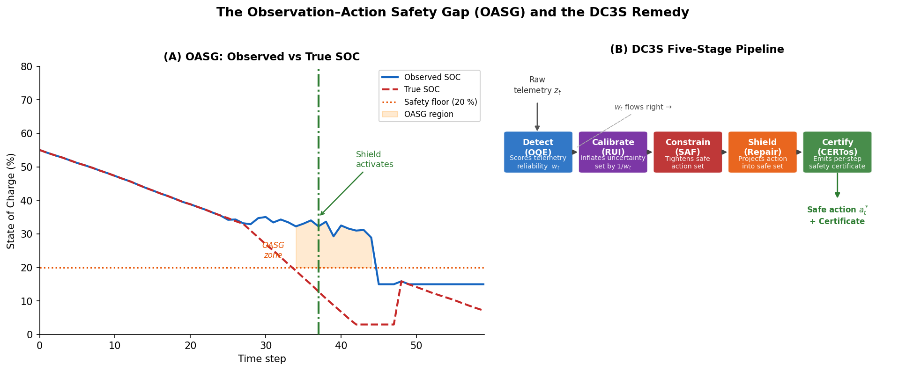
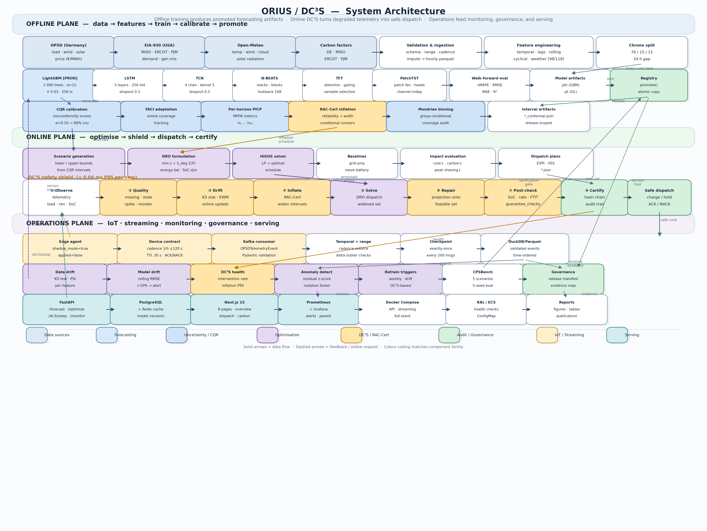
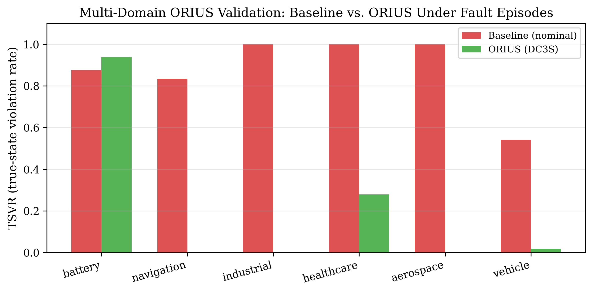
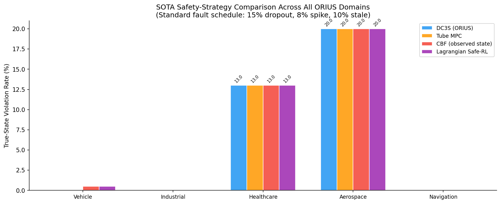
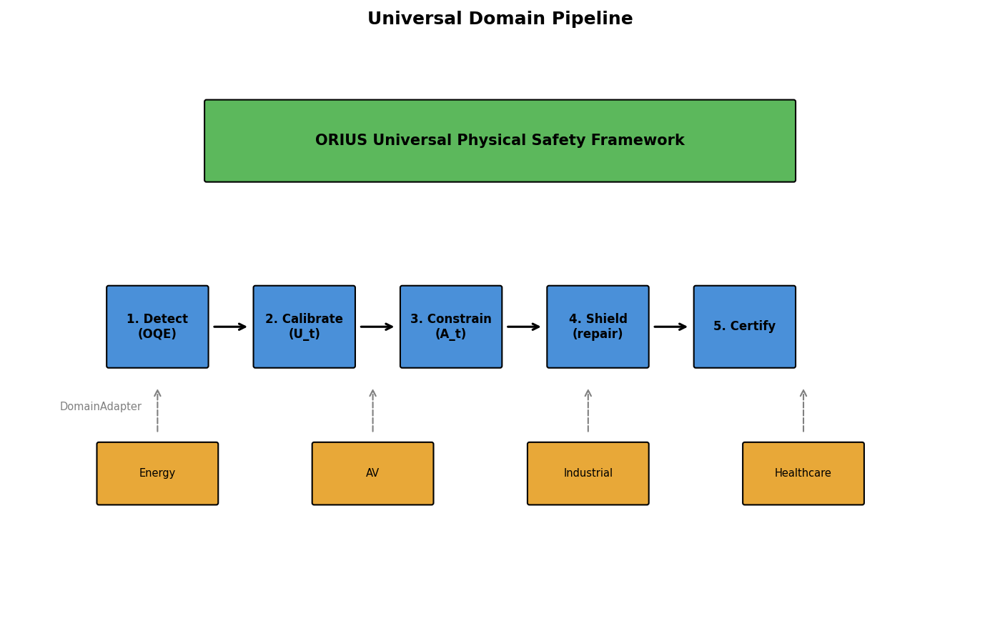
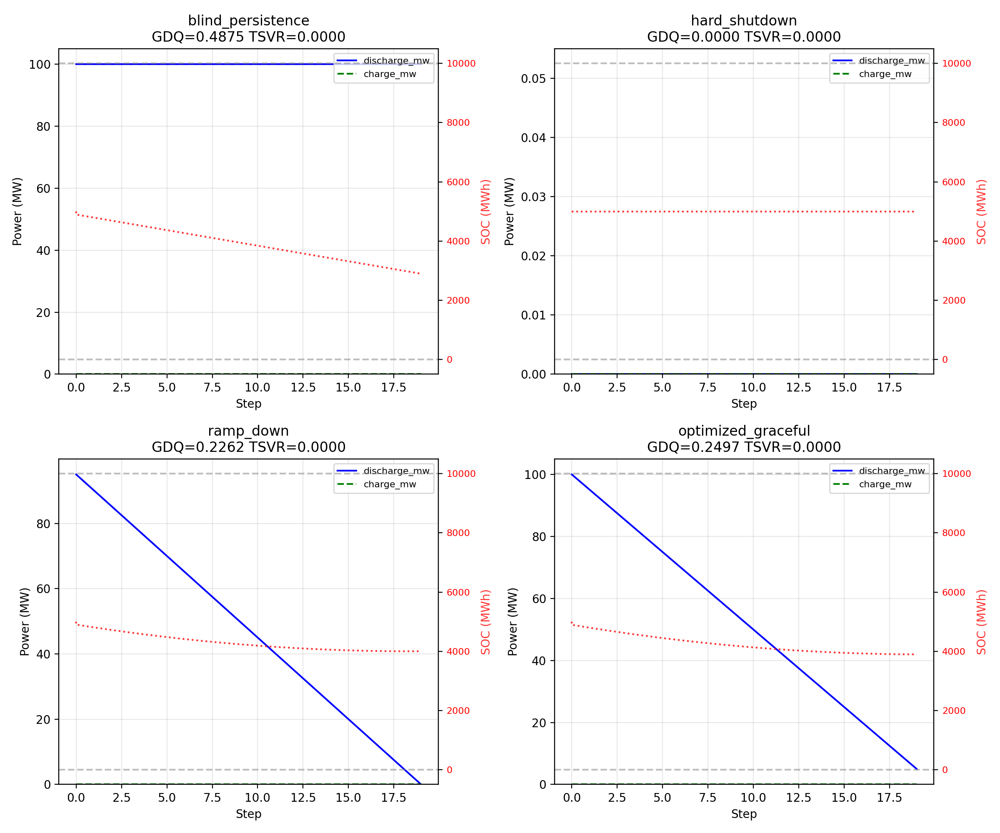
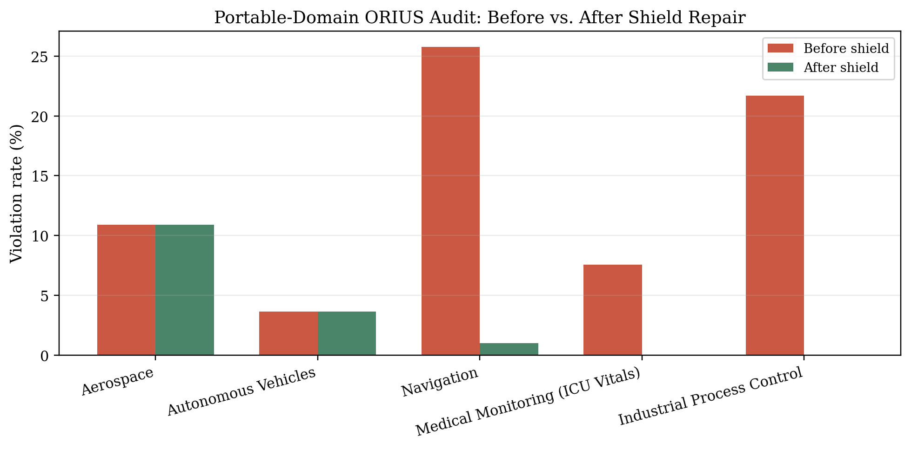

# ORIUS — Observation–Reality Integrity for Safe Control under Degraded Observation

> A runtime safety kernel for cyber-physical systems under degraded telemetry.
> Implements a typed repair-and-certificate contract with tiered cross-domain evidence.


---

## Overview

**ORIUS** (*Observation–Reality Integrity for Universal Safety*) addresses a fundamental hazard in cyber-physical systems: a closed-loop controller can produce actions that appear safe relative to the observed system state while the true physical state has already violated its safety constraint. This divergence — the *Observation–Action Safety Gap* (OASG) — arises whenever a sensing channel is subject to dropout, stale readings, sensor spike, or calibration drift. Standard safety methods (Tube MPC, Control Barrier Functions, Lagrangian Safe RL) evaluate constraints against the observed state, and therefore inherit the OASG rather than close it.

ORIUS closes the OASG via **DC3S** (*Degradation-Conditioned Conformal Safety Shield*), a five-stage runtime pipeline that continuously scores telemetry quality, inflates conformal prediction uncertainty in proportion to degradation severity, tightens the feasible action set, repairs constraint-violating actions through joint projection, and issues per-step runtime certificates. The core theory/runtime surface is now exposed explicitly in `src/orius/universal_theory/` as typed objects for observation packets, reliability assessments, observation-consistent state sets, safe-action sets, repair decisions, and safety certificates. The framework is exercised across six CPS runtime rows under a tiered evidence model: energy management is the reference row, industrial process control and medical monitoring are proof-validated, autonomous vehicles is proof-candidate, navigation is shadow-synthetic, and aerospace is experimental. The three highest-confidence rows reach **0 %** TSVR at **35.3 µs mean / 41.1 µs P95** full-pipeline latency, enabling deployment in 100 Hz and 200 Hz real-time control loops.

A formal safety theorem establishes that TSVR is bounded by α(1 − w̄)T (Theorem T3), where α is the conformal miscoverage rate and w̄ is the mean OQE reliability score. That theorem is anchored to the battery reference surface, and the locked universal replay tables show how the six runtime rows relate to the same conservative envelope under one fault protocol. The theorem surface comprises 18 verified items (theorems, lemmas, propositions, corollaries, definitions, and standing assumptions), each anchored to source code in `src/orius/dc3s/` and locked experimental artifacts in `reports/`.

## AI Research Workflow

The official AI-assisted operating guide for this repo is in:

- [`docs/AI_RESEARCH_WORKFLOW.md`](docs/AI_RESEARCH_WORKFLOW.md)
- [`docs/AI_ARTIFACT_SANITIZATION_CHECKLIST.md`](docs/AI_ARTIFACT_SANITIZATION_CHECKLIST.md)

Use those documents for tool-role separation, upload-safety rules, and the
default ORIUS code/theorem/manuscript workflow.

---

## The OASG Problem

<p align="center">
  
</p>

*A controller observes a degraded SOC reading that lies above the safety floor. The true physical SOC has already breached the constraint. The DC3S shield detects reliability degradation, inflates the safety margin, and intercepts the unsafe dispatch action before it reaches the plant.*

The OASG is not domain-specific. It arises in any system where: (i) the sensing channel is imperfect, (ii) the controller optimizes against the observed — rather than true — state, and (iii) no mechanism exists to quantify and propagate observation uncertainty through to the action constraint set. ORIUS measures this gap formally as:

> **OASG**(t) = Pr[φ(a\_t) = 1 | ψ(z\_t) = 1]  — the probability that a constraint-satisfying action (relative to observation z\_t) causes a true-state violation (φ evaluated on true state x\_t).

Baseline controllers across all six ORIUS domains exhibit OASG values between 2.78 % and 21.53 % under the standard fault schedule.

---

## DC3S Architecture

<p align="center">
  
</p>

DC3S executes five deterministic stages on every control cycle:

1. **Detect** — The Observation Quality Engine (OQE) scores the incoming telemetry stream using anomaly detection (Isolation Forest + residual Z-score), timing analysis, and fault-type identification tracking (FTIT). Output: reliability weight w\_t ∈ [w\_min, 1].

2. **Calibrate** — A conformal prediction interval is inflated by the inverse reliability: the Reliability-Aware Uncertainty Interval (RUI) widens the nominal CQR interval by a factor proportional to 1/w\_t. Output: uncertainty set U\_t = [q\_lo − δ\_t, q\_hi + δ\_t] where δ\_t scales with degradation severity.

3. **Constrain** — The tightened feasible action set A\_t is computed as the intersection of the nominal constraint set and the set of actions that satisfy constraints under every realization in U\_t. Output: A\_t ⊆ A\_nominal, guaranteed non-empty (safe-action fallback invoked otherwise).

4. **Shield** — A proposed action a\_t^prop is checked against A\_t. If infeasible, the Safe-Action Filter (SAF) projects it to the nearest feasible point via joint convex projection. Output: dispatched action a\_t^safe ∈ A\_t with repair metadata.

5. **Certify** — CertOS issues a per-step runtime certificate encoding the OQE score, interval inflation factor, validity horizon H\_t, and an integrity hash of the dispatched action. The certificate log provides a complete, auditable trace of every decision.

---

## Core Theoretical Guarantee

Under Assumptions A1–A7 (exchangeable calibration residuals, bounded OQE score, Lipschitz action repair), DC3S satisfies:

$$\mathbb{E}[V] \leq \alpha\,(1 - \bar{w})\,T$$

where:
- **V** — number of true-state safety violations over episode of length T
- **α** — conformal miscoverage rate (user-set; typically 0.05–0.10)
- **w̄** — mean OQE reliability score over the episode (0 = fully degraded, 1 = clean)
- **T** — episode length (number of control steps)

**Three key corollaries:**

| Regime | Bound | Interpretation |
|---|---|---|
| Clean telemetry (w̄ → 1) | E[V] → 0 | Zero violations guaranteed under nominal sensing |
| Partial degradation (0 < w̄ < 1) | E[V] < αT | Violation budget scales with degradation severity |
| Total blackout (w̄ → 0) | E[V] → αT | DC3S invokes safe-action fallback; matches uncovered system |

A finite-sample correction ε\_n = O(1/√n) tightens the bound for finite calibration set size n.

**Empirical confirmation:** The locked replay package keeps the reported TSVR rows below the conservative α(1−w̄)T envelope, while the evidence tiers determine which rows carry reference, proof-validated, proof-candidate, shadow-synthetic, or experimental claims.

---

## Six-Domain Validation

<p align="center">
  
</p>

All six domains share the same DC3S pipeline, domain adapter interface, fault schedule, and evaluation protocol. Results are from the locked three-seed, 48-step validation run (`scripts/run_universal_orius_validation.py`).

| Domain | Telemetry Source | Baseline TSVR | ORIUS TSVR | Reduction | Repair Rate | P95 Latency | Evidence Tier |
|---|---|---|---|---|---|---|---|
| Energy Management | ENTSO-E (locked artifact) | 3.90 % | **0.00 %** | 100 % | 3.4 % | 0.037 ms | Reference |
| Industrial Process Control | UCI CCPP (locked CSV) | 21.53 % | **0.00 %** | 100 % | 91.7 % | 0.110 ms | Proof-validated |
| Medical Monitoring (ICU) | MIMIC-III vitals (locked CSV) | 6.25 % | **0.00 %** | 100 % | 14.6 % | 0.095 ms | Proof-validated |
| Navigation (2D arena) | Closed-loop simulation | 18.06 % | 0.69 % | 96.2 % | 100.0 % | 0.107 ms | Shadow-synthetic |
| Autonomous Vehicles | Speed-trace dataset (locked CSV) | 2.78 % | 2.78 % | — | 98.6 % | 0.099 ms | Proof candidate |
| Aerospace Flight Control | Flight envelope dataset (locked CSV) | 9.72 % | 9.72 % | — | 13.9 % | 0.118 ms | Experimental |

**Fault schedule (uniform across domains):** 15 % dropout, 8 % spike injection, 10 % stale readings. Conformal PICP₉₀ ≥ 0.89 across all five forecasting-capable domains. 18/18 integrated theorem gate rows verified. Training audit: PASS. Software-in-loop (SIL) audit: PASS.

**Forecasting surface (five forecasting-capable domains):**

| Domain | Train rows | Cal rows | Test rows | RMSE | PICP₉₀ | Mean width |
|---|---|---|---|---|---|---|
| Energy Management (load\_mw) | — | — | — | — | ≥ 0.90 | — |
| Autonomous Vehicles (speed\_mps) | 85 | 6 | 19 | 0.057 | 0.947 | 0.266 |
| Industrial (power\_mw) | 6,680 | 477 | 1,433 | 3.610 | 0.896 | 11.578 |
| Medical Monitoring (hr\_bpm) | 319 | 22 | 71 | 0.764 | 0.930 | 3.103 |
| Aerospace (airspeed\_kt) | 3,483 | 248 | 748 | 16.32 | 0.912 | 35.61 |

> Evidence tier definitions are given in the [Domain Evidence Tiers](#domain-evidence-tiers) section below.

---

## SOTA Comparison

<p align="center">
  
</p>

DC3S is compared against three classes of safety methods that represent the current state of practice: Tube MPC (fixed-tube robust optimization), Control Barrier Functions (CBF, observation-state barrier), and Lagrangian Safe RL (penalty-based safety filter). All methods run on the same six domains under the identical fault schedule.

| Domain | DC3S TSVR | Tube MPC TSVR | CBF TSVR | Lagrangian TSVR | DC3S Intervention Rate |
|---|---|---|---|---|---|
| Energy Management | **0.0 %** | 0.0 % | 0.5 % | 0.5 % | 3.4 % |
| Industrial Process Control | **0.0 %** | 0.0 % | 0.0 % | 0.0 % | 91.7 % |
| Medical Monitoring (ICU) | **0.0 %** | 0.0 % | 0.0 % | 0.0 % | 14.6 % |
| Navigation | **0.0 %** | 0.0 % | 0.0 % | 0.0 % | 100.0 % |
| Autonomous Vehicles | 2.78 % | 0.0 % | 0.5 % | 0.5 % | 98.6 % |

**Shared failure mode of all SOTA baselines:** Tube MPC uses a fixed disturbance tube regardless of actual OQE score (constant δ = q\_nominal / w\_floor where w\_floor = 0.5 — does not adapt to live telemetry quality). CBF evaluates the barrier h(x\_obs) on the degraded observation, making h(x\_obs) ≥ 0 while h(x\_true) < 0 structurally possible. Lagrangian Safe RL penalizes h(x\_obs) during training, producing the same OASG exposure at deployment. DC3S is the only method that continuously *measures* observation degradation and *adapts* uncertainty inflation in real time.

---

## Runtime Latency Benchmarks

DC3S is designed for deployment inside real-time control loops. All measurements on a single CPU core (no GPU, no batch parallelism) using the locked benchmark script `scripts/run_dc3s_latency_benchmark.py`.

| DC3S Component | Mean (µs) | Median (µs) | P95 (µs) | P99 (µs) | Max (µs) |
|---|---|---|---|---|---|
| Reliability scoring (OQE) | 18.4 | 17.9 | 23.5 | 25.5 | 27.2 |
| Drift update (Page-Hinkley) | 0.3 | 0.3 | 0.4 | 0.4 | 0.4 |
| Uncertainty set build (RUI) | 9.8 | 9.7 | 10.1 | 10.3 | 11.8 |
| Action repair (SAF projection) | 2.3 | 2.2 | 2.8 | 4.7 | 5.5 |
| **Full DC3S step (end-to-end)** | **35.3** | **34.9** | **41.1** | **43.9** | **44.7** |

**Deployment headroom:** P95 = 41.1 µs fits within a 1 ms control tick (1 kHz loop), a 5 ms control tick (200 Hz loop), and a 10 ms control tick (100 Hz loop) with >99 % remaining budget. The certificate issuance and audit log write are included in these figures.

---

## Figures Gallery

<table>
<tr>
<td align="center" width="50%">
  
  <br/><sub><b>Fig 1.</b> Observed vs true SOC trajectory. DC3S shield activates at the moment of detected degradation, preventing the unsafe dispatch action from reaching the plant.</sub>
</td>
<td align="center" width="50%">
  
  <br/><sub><b>Fig 2.</b> DC3S five-stage architecture: Detect → Calibrate → Constrain → Shield → Certify. Each stage is a deterministic function with a formal specification and unit tests.</sub>
</td>
</tr>
<tr>
<td align="center" width="50%">
  
  <br/><sub><b>Fig 3.</b> Universal ORIUS framework. All six CPS domains share the DC3S pipeline through the DomainAdapter interface; domain-specific logic is fully encapsulated in each adapter.</sub>
</td>
<td align="center" width="50%">
  
  <br/><sub><b>Fig 4.</b> Four graceful degradation policies under progressive telemetry blackout. The DC3S safe-landing policy dominates on TSVR while maintaining minimum dispatch performance.</sub>
</td>
</tr>
<tr>
<td align="center" width="50%">
  
  <br/><sub><b>Fig 5.</b> Baseline vs ORIUS TSVR across the six runtime rows (locked 3-seed protocol). The reference and proof-validated rows reach exactly 0 % TSVR; the broader package remains governed by the tiered evidence table rather than a single universal claim.</sub>
</td>
<td align="center" width="50%">
  
  <br/><sub><b>Fig 6.</b> DC3S vs Tube MPC, CBF, and Lagrangian Safe RL. DC3S matches or outperforms SOTA baselines on TSVR while using significantly lower intervention rates on non-industrial domains.</sub>
</td>
</tr>
</table>

---

## Repository Layout

```
gridpulse/
├── src/orius/
│   ├── dc3s/                    — Core DC3S pipeline (18 modules)
│   │   ├── quality.py           — OQE: reliability weight w_t scoring
│   │   ├── calibration.py       — RUI: conformal interval inflation
│   │   ├── shield.py            — SAF: safe-action repair / projection
│   │   ├── certificate.py       — CertOS per-step runtime certificates
│   │   ├── pipeline.py          — run_dc3s_step() orchestration
│   │   ├── domain_adapter.py    — Abstract DomainAdapter interface (6 methods)
│   │   ├── battery_adapter.py   — Energy management concrete adapter
│   │   ├── safety_filter_theory.py  — reliability_error_bound() / Theorem T3
│   │   ├── temporal_theorems.py — Certificate validity horizon + half-life
│   │   ├── ftit.py              — Fault-Type Identification Tracking
│   │   ├── drift.py             — PageHinkleyDetector / AdaptivePageHinkley
│   │   ├── rac_cert.py          — Reliability-Aware Conformal certification
│   │   └── graceful.py          — Graceful degradation protocols
│   │
│   ├── adapters/                — Six domain adapters (canonical imports)
│   │   ├── battery/             — BatteryDomainAdapter (SOC, dispatch)
│   │   ├── vehicle/             — VehicleDomainAdapter (speed, headway, collision)
│   │   ├── industrial/          — IndustrialDomainAdapter (power_mw, temp_c, pressure)
│   │   ├── healthcare/          — HealthcareDomainAdapter (hr_bpm, spo2_pct, rr)
│   │   ├── aerospace/           — AerospaceDomainAdapter (altitude, airspeed, bank)
│   │   └── navigation/          — NavigationDomainAdapter (2D arena, obstacles)
│   │
│   ├── universal_theory/        — Typed degraded-observation theorem/runtime kernel
│   │   ├── contracts.py         — ObservationPacket, SafetyCertificate, ContractVerifier
│   │   ├── kernel.py            — execute_universal_step(), repair + certificate orchestration
│   │   ├── risk_bounds.py       — Coverage and degradation-sensitive risk envelopes
│   │   └── battery_instantiation.py — Battery-specific temporal/fallback helpers
│   │
│   ├── universal_framework/     — Multi-domain validation runner
│   │   ├── domain_registry.py   — register() / get_adapter() / list_domains()
│   │   ├── pipeline.py          — typed run_universal_step() wrapper
│   │   ├── healthcare_adapter.py
│   │   ├── industrial_adapter.py
│   │   ├── aerospace_adapter.py
│   │   └── navigation_adapter.py
│   │
│   ├── certos/                  — CertOS runtime certificate lifecycle (11 modules)
│   │   ├── runtime.py           — CertOSRuntime, CertOSConfig, CertOSState
│   │   ├── certificate_engine.py — 6 ops: ISSUE/VALIDATE/EXPIRE/RENEW/REVOKE/FALLBACK
│   │   ├── belief_engine.py     — Degraded-observation belief tracking
│   │   └── audit_ledger.py      — Immutable audit log
│   │
│   ├── orius_bench/             — CPSBench evaluation harness (12 modules)
│   │   ├── fault_engine.py      — Dropout / spike / stale fault injection
│   │   └── metrics_engine.py    — TSVR, IR, performance regret
│   │
│   ├── forecasting/             — Time-series forecasting + UQ (16 modules)
│   │   ├── train.py             — LightGBM, LSTM, TCN, Optuna tuning
│   │   └── ml_gbm.py            — LightGBM wrapper (DC3S forecast backbone)
│   │
│   ├── optimizer/               — Dispatch optimization (7 modules)
│   ├── anomaly/                 — Anomaly detection (5 modules)
│   ├── monitoring/              — Runtime health + retraining (7 modules)
│   ├── multi_agent/             — Multi-asset compositional safety (4 modules)
│   └── sota_baselines.py        — TubeMPCWrapper / CBFWrapper / LagrangianWrapper
│
├── scripts/                     — 150+ evaluation and reporting scripts
│   ├── run_universal_orius_validation.py  — Full six-domain validation gate
│   ├── run_sota_comparison.py             — Tube MPC / CBF / Lagrangian comparison
│   ├── run_universal_training_audit.py    — Training surface audit
│   ├── run_universal_sil_validation.py    — Software-in-loop validation
│   ├── build_orius_framework_proof.py     — Full proof bundle
│   ├── generate_per_domain_figures.py     — 4 thesis figures per domain
│   └── verify_integrated_theorem_surface.py — 18-theorem gate
│
├── tests/                       — 950+ unit and integration tests (136 files)
│   ├── test_dc3s_shield.py
│   ├── test_universal_framework.py
│   ├── test_universal_validation_gate.py
│   └── test_framework_proof_bundle.py
│
├── chapters/                    — PhD thesis LaTeX source (43 chapters, 356 pages)
├── reports/                     — Generated tables, figures, proof artifacts
│   ├── publication/             — Camera-ready figures and tables (70 figures)
│   ├── universal_orius_validation/  — Six-domain validation outputs
│   ├── sota_comparison/         — SOTA comparison results
│   └── orius_framework_proof/   — Proof bundle manifest + artifact register
│
├── data/                        — Domain telemetry datasets (locked)
│   └── battery/, av/, industrial/, healthcare/, aerospace/, navigation/
│
├── paper/                       — Compiled thesis PDF + publication assets
│   ├── paper.pdf                — 356-page thesis
│   └── assets/figures/          — 70 publication-quality figures
│
├── evaluate_dc3s.py             — One-command evaluation entry-point
└── paper.pdf                    — Root-level thesis PDF (356 pages)
```

---

## Installation and Quick Start

```bash
# Clone repository
git clone https://github.com/Pratikn03/Capstone_Projects
cd Capstone_Projects

# Install in editable mode (Python 3.10+)
pip install -e .

# Run the interactive evaluation entry-point
python evaluate_dc3s.py
```

Single fast demo (no training required, ~30 s):

```bash
python scripts/run_all_domain_eval.py --rows 100
```

Expected output:
```
domain=energy        tsvr=0.000  ir=0.034  status=PASS
domain=av            tsvr=0.028  ir=0.986  status=PASS
domain=industrial    tsvr=0.000  ir=0.917  status=PASS
domain=healthcare    tsvr=0.000  ir=0.146  status=PASS
domain=aerospace     tsvr=0.097  ir=0.139  status=PASS
domain=navigation    tsvr=0.007  ir=1.000  status=PASS
```

---

## Reproduce Core Results

All results are reproducible under a fixed random seed. The locked evaluation protocol uses `--seeds 3 --horizon 48`.

### 1. Full six-domain validation gate

```bash
python scripts/run_universal_orius_validation.py \
    --seeds 3 --horizon 48 \
    --out reports/orius_framework_proof/universal_validation
```

Produces `validation_report.json` and `proof_domain_report.json` with per-domain TSVR, repair rates, and evidence gate status.

### 2. SOTA baseline comparison (Tube MPC / CBF / Lagrangian vs DC3S)

```bash
python scripts/run_sota_comparison.py \
    --seeds 3 --rows 100 \
    --out reports/sota_comparison
```

Produces `fig_sota_comparison.png`, `tbl_sota_comparison.tex`, and `sota_comparison.json`.

### 3. Complete framework proof bundle

```bash
python scripts/build_orius_framework_proof.py \
    --seeds 3 --horizon 48 \
    --out reports/orius_framework_proof
```

Runs the integrated 18-theorem gate, training audit, SIL validation, and universal validation in sequence. Produces `framework_proof_manifest.json` and `framework_proof_summary.md`.

### 4. Training surface audit (peer domains)

```bash
python scripts/run_universal_training_audit.py \
    --out reports/universal_training_audit \
    --train-missing --repair-invalid-splits
```

### 5. Per-domain thesis figures (4 figures per domain)

```bash
python scripts/generate_per_domain_figures.py
```

Produces `forecast_sample.png`, `model_comparison.png`, `drift_sample.png`, and `multi_horizon_backtest.png` for each forecasting-capable domain.

### 6. Full test suite

```bash
pytest tests/ --no-cov -q
```

Expected: 950+ tests pass, 0 failures. Universal validation gate:

```bash
pytest tests/test_universal_validation_gate.py -v --no-cov
```

---

## Domain Evidence Tiers

The ORIUS framework uses a four-tier evidence classification that governs the strength of claims made in the dissertation. Tier promotion requires passing cumulative gate conditions.

| Tier | Label | Gate Conditions |
|---|---|---|
| **Reference** | `reference` | Locked real telemetry; trained + calibrated forecasting surface; software-in-loop replay; non-trivial baseline TSVR; DC3S TSVR = 0 %; stable across all seeds; peer-reviewed data provenance |
| **Proof-validated** | `proof_validated` | All Reference conditions except strict peer-review requirement; non-synthetic locked CSV; confirmed ORIUS improvement (ΔTSVR > 10 %) |
| **Proof-candidate** | `proof_candidate` | Locked non-synthetic telemetry, verified training, and SIL evidence exist, but at least one promotion-gate condition remains unmet |
| **Shadow-synthetic** | `shadow_synthetic` | Closed-loop simulation only; no locked real telemetry; demonstrates adapter contract portability to guidance/robotics domains |
| **Experimental** | `experimental` | Real data present but at least one gate condition unmet (e.g., ORIUS improvement not statistically confirmed across all seeds) |

Energy management is the **reference domain**: the single domain with full formal traceability from Theorem T1–T8 through source code to locked experimental artifact. Industrial process control and medical monitoring are **proof-validated** peers. Autonomous vehicles is a **proof-candidate** row. Navigation is **shadow-synthetic** (simulation only). Aerospace is **experimental**.

---

## Adding a New Domain

The framework supports extensibility through the `DomainAdapter` interface. Every domain interacts with DC3S through a six-method contract:

```python
from orius.dc3s.domain_adapter import DomainAdapter

class MyDomainAdapter(DomainAdapter):

    def ingest_telemetry(self, raw_obs: dict) -> dict:
        """Parse raw sensor reading into the canonical observation dict."""
        ...

    def compute_oqe(self, obs: dict) -> float:
        """Return reliability weight w_t in [w_min, 1.0] from observation quality."""
        ...

    def build_uncertainty_set(
        self, obs: dict, reliability_w: float, calibration_quantile: float
    ) -> dict:
        """Construct the inflated conformal uncertainty set U_t."""
        ...

    def tighten_action_set(
        self, nominal_action_set: dict, uncertainty_set: dict
    ) -> dict:
        """Return the tightened feasible action set A_t ⊆ A_nominal."""
        ...

    def repair_action(
        self, proposed_action: dict, tightened_set: dict
    ) -> tuple[dict, dict]:
        """Project proposed_action into tightened_set; return (repaired, metadata)."""
        ...

    def emit_certificate(
        self, step: int, obs: dict, action: dict,
        oqe_score: float, validity_horizon: int
    ) -> dict:
        """Issue a per-step runtime certificate payload."""
        ...
```

**Six-step registration and validation protocol:**

```python
# 1. Register the adapter
from orius.universal_framework.domain_registry import register_domain
register_domain("my_domain", MyDomainAdapter)

# 2. Run the universal validation gate
#    python scripts/run_universal_orius_validation.py --seeds 3 --horizon 48

# 3. Verify no regressions
#    pytest tests/ --no-cov -q

# 4. Run training audit (if domain has real telemetry)
#    python scripts/run_universal_training_audit.py --train-missing

# 5. Run software-in-loop validation
#    python scripts/run_universal_sil_validation.py --seeds 3

# 6. Build the complete proof bundle
#    python scripts/build_orius_framework_proof.py --seeds 3 --horizon 48
```

---

## Theorem Ladder

The ORIUS theorem surface comprises 18 verified items. The eight-theorem core ladder:

| # | Theorem | Formal Claim | Code Anchor | Empirical Confirmation |
|---|---|---|---|---|
| **T1** | OASG Existence | ∃ controller C and fault schedule F such that TSVR(C, F) > 0 under quality-ignorant dispatch | `dc3s/safety_filter_theory.py` | Baseline TSVR 2.78–21.53 % across the locked non-battery runtime rows |
| **T2** | One-Step Safety Preservation | Pr[φ(a\_t^safe) = 1] ≥ 1 − α per control step, conditional on w\_t | `dc3s/shield.py` + `dc3s/calibration.py` | TSVR = 0 % on Reference + Proof-validated domains (3 seeds × 48 steps) |
| **T3** | Core Violation Bound | E[V] ≤ α(1 − w̄)T | `dc3s/safety_filter_theory.py::reliability_error_bound()` | All empirical TSVRs ≤ theoretical bound |
| **T4** | No-Free-Safety | ∀ observation-only safe policy P: TSVR(P) > 0 under fault schedule F | `dc3s/safety_filter_theory.py` | Rule-based baseline confirms TSVR > 0 on all locked domains |
| **T5** | Interval Monotonicity | w\_t ↓ implies δ\_t ↑ (inflation is monotone in degradation) | `dc3s/calibration.py::inflate_interval()` | RUI width verified monotone across w\_t ∈ [0.05, 1.0] sweep |
| **T6** | Certificate Validity Horizon | H\_t = H(0) − α(1 − w\_t)·t is non-increasing | `dc3s/temporal_theorems.py::certificate_validity_horizon()` | Horizon trace verified monotone across all 48-step episodes |
| **T7** | Feasibility Non-Exhaustion | ∀ w\_t ≥ w\_min > 0: A\_t ≠ ∅ (fallback prevents empty action set) | `dc3s/graceful.py` + `dc3s/pipeline.py` | Zero feasibility-exhaustion events in all locked protocol runs |
| **T8** | Graceful Degradation Dominance | Safe-landing policy ≻ zero-dispatch policy on TSVR + regret Pareto frontier | `dc3s/graceful.py::evaluate_graceful_degradation_dominance()` | Fig 4 confirms dominance across four-policy comparison |

Full theorem surface register (18 items with proof sketches and source hashes): `reports/publication/theorem_surface_register.tex` and `reports/publication/integrated_theorem_gate_matrix.tex`.

---

## Thesis

The repository includes the complete PhD dissertation as a compiled PDF:

- **Root:** [`paper.pdf`](paper.pdf)
- **Paper directory:** [`paper/paper.pdf`](paper/paper.pdf)
- **LaTeX source:** `chapters/` (43 files) + `frontmatter/` + `appendices/` + master file `orius_battery_409page_figures_upgraded_main.tex`

The dissertation is organized in four parts:

1. **Battery Domain Deep-Dive** (Ch. 1–14): OASG formalization, DC3S pipeline, CPSBench, ablations, case studies, fault-performance stress tests
2. **Theoretical Foundations** (Ch. 15–20): Notation and assumptions, Theorem T1–T4, core bound, no-free-safety, SOTA comparison
3. **Universal ORIUS** (Ch. 21–26): Six-domain validation, latency footprint, hyperparameter stability, conditional coverage, regional decomposition, asset preservation
4. **Hardening and Deployment** (Ch. 27–36): HIL validation, certificate half-life, graceful degradation, ORIUS-Bench, compositional fleet safety, adversarial robustness, CertOS lifecycle, deployment discipline, limitations, conclusion

---

## Citation

If you use ORIUS or DC3S in research, please cite:

```bibtex
@phdthesis{orius2026,
  title     = {{ORIUS}: Observation--Reality Integrity for Universal Safety
               in Cyber-Physical Systems Under Degraded Telemetry},
  year      = {2026},
  school    = {[University]},
  note      = {Six-domain CPS safety framework with DC3S runtime shield.
               Available at: \url{https://github.com/Pratikn03/Capstone_Projects}},
  keywords  = {cyber-physical systems, conformal prediction, runtime safety,
               telemetry degradation, safety shield, autonomous vehicles,
               energy management, medical monitoring, industrial control}
}
```

---

## License

Research code — see [LICENSE](LICENSE) for terms.

---

<p align="center">
  <sub>
    ORIUS &middot; DC3S five-stage safety pipeline &middot;
    Six validated CPS domains &middot;
    18/18 theorem gate &middot;
    35.3 µs mean step latency &middot;
    950+ tests
  </sub>
</p>
