# GridPulse: Autonomous Energy Intelligence & Optimization Platform


GridPulse is a production-grade energy intelligence platform that forecasts load, wind, and solar generation across **two countries** (Germany & USA), detects anomalies, optimizes dispatch under cost and carbon objectives, and serves results through a real-time Next.js operator dashboard — all backed by **21 trained ML models** and real-world data.

---

## Key Results

### Germany (OPSD) — 17,377 hourly observations × 98 features

| Model | Target | RMSE (MW) | MAE (MW) | R² | 90% Coverage |
|---|---|---:|---:|---:|---:|
| **GBM** | load_mw | 271.2 | 161.1 | 0.9991 | 95.2% |
| **GBM** | wind_mw | 127.1 | 87.3 | 0.9997 | 92.4% |
| **GBM** | solar_mw | 269.6 | 129.5 | 0.9991 | 89.4% |
| LSTM | load_mw | 2,356.0 | 1,732.1 | 0.931 | — |
| TCN | load_mw | 3,394.2 | 2,613.5 | 0.857 | — |

**Impact:** 2.89% cost savings · 0.58% carbon reduction · 7.09% peak shaving

### USA (EIA-930 / MISO) — 13,638 hourly observations × 118 features

| Model | Target | RMSE (MW) | MAE (MW) | R² | 90% Coverage |
|---|---|---:|---:|---:|---:|
| **GBM** | load_mw | 139.8 | 104.2 | 0.9997 | 87.4% |
| **GBM** | wind_mw | 239.6 | 109.4 | 0.9986 | 80.5% |
| **GBM** | solar_mw | 212.9 | 76.2 | 0.9961 | 90.5% |
| LSTM | load_mw | 3,684.7 | — | 0.762 | — |
| TCN | load_mw | 4,235.4 | — | 0.685 | — |

**Impact:** 0.43% cost savings · Battery dispatch optimization

### Conformal Prediction Coverage (90% Nominal)

| Dataset | Target | PICP (%) | MPIW (MW) | N_test |
|---|---|---:|---:|---:|
| Germany | Load | **95.2** | 742.7 | 1,739 |
| Germany | Wind | 92.4 | 350.8 | 1,739 |
| Germany | Solar | 89.4 | 622.7 | 1,739 |
| USA | Load | **87.4** | 415.6 | 1,364 |
| USA | Wind | 80.5 | 299.8 | 1,364 |
| USA | Solar | **90.5** | 421.4 | 1,364 |

> PICP = Prediction Interval Coverage Probability · MPIW = Mean Prediction Interval Width

### Statistical Significance (Diebold-Mariano Test)

| Model 1 | Model 2 | DM Stat | p-value | Result |
|---|---|---:|---:|---|
| GBM | LSTM | -9.42 | <0.001 | GBM significantly better*** |
| GBM | TCN | -7.46 | <0.001 | GBM significantly better*** |
| GBM | Persistence | -12.31 | <0.001 | GBM significantly better*** |

### Ablation Study

| Configuration | Mean Cost | Regret (%) | Note |
|---|---:|---:|---|
| **Full System** | €428.2M | — | Baseline |
| No Uncertainty | €428.2M | 0.0% | Point forecasts only |
| No Carbon Weight | €377.8M | -11.8% | Cost-only optimization |

---

## Architecture

```mermaid
%%{init: {
  'theme': 'base',
  'themeVariables': {
    'primaryColor': '#1a1b26',
    'primaryTextColor': '#c0caf5',
    'primaryBorderColor': '#7aa2f7',
    'lineColor': '#7aa2f7',
    'secondaryColor': '#24283b',
    'tertiaryColor': '#1a1b26',
    'fontFamily': 'Inter, system-ui, sans-serif',
    'fontSize': '14px'
  }
}}%%

flowchart TB
  subgraph sources["🗄️ DATA SOURCES"]
    direction LR
    A1["🇩🇪 OPSD Germany<br/>Load · Wind · Solar · Price"]
    A2["🇺🇸 EIA-930 USA<br/>MISO Demand · Generation"]
    A3["🌤️ Open-Meteo<br/>Berlin · Chicago Weather"]
  end

  subgraph pipeline["⚙️ DATA PIPELINE"]
    direction TB
    B["📥 Ingestion & Validation"]
    C["🔧 Feature Engineering<br/>Lags · Calendar · Weather"]
    D["📊 Time-Series Splits<br/>Train · Val · Test"]
    B --> C --> D
  end

  subgraph ml["🤖 ML ENGINE"]
    direction TB
    E["🌳 LightGBM<br/>21 Ensemble Models"]
    F["🧠 Deep Learning<br/>LSTM · TCN"]
    G["📏 Conformal Prediction<br/>90% Coverage Intervals"]
    E & F --> G
  end

  subgraph ops["🔄 OPERATIONS"]
    direction TB
    H["🚨 Anomaly Detection<br/>Z-Score · IsolationForest"]
    I["⚡ LP Optimizer<br/>Cost · Carbon · Battery"]
    J["📈 MLOps Monitor<br/>Drift · Retraining"]
  end

  subgraph serve["🚀 SERVING"]
    direction TB
    K["🔌 FastAPI Backend<br/>/forecast · /optimize · /monitor"]
    L["💻 Next.js 15 Dashboard<br/>8 Pages · Region Toggle"]
    K --> L
  end

  sources --> pipeline
  pipeline --> ml
  ml --> ops
  ops --> serve

  style sources fill:#1e3a5f,stroke:#7aa2f7,stroke-width:2px,color:#c0caf5
  style pipeline fill:#1e3a5f,stroke:#9ece6a,stroke-width:2px,color:#c0caf5
  style ml fill:#1e3a5f,stroke:#bb9af7,stroke-width:2px,color:#c0caf5
  style ops fill:#1e3a5f,stroke:#f7768e,stroke-width:2px,color:#c0caf5
  style serve fill:#1e3a5f,stroke:#7dcfff,stroke-width:2px,color:#c0caf5
```



---

## Dashboard

The Next.js 15 operator dashboard shows **real ML results** — no mock data on production pages.

| Page | Description |
|---|---|
| **Overview** | KPIs, dispatch chart, model registry, dataset stats |
| **Forecasting** | Forecast vs actual, model comparison table, hourly profiles |
| **Optimization** | Dispatch plan, battery SOC, cost impact panel |
| **Carbon** | Carbon impact breakdown, baseline vs optimized emissions |
| **Anomalies** | Z-score timeline, event log, data quality overview |
| **Monitoring** | Model drift, active model versions, artifact sizes |
| **Reports** | Formal evaluation, model cards, publication figures |
| **Data Explorer** | Dataset statistics, time series, hourly profiles, forecast comparison |

All pages support a **DE / US region toggle** in the top bar.

---

## Technology Stack

| Layer | Technologies |
|---|---|
| **ML/Data** | Python 3.11, LightGBM 4.6, PyTorch 2.8, scikit-learn, Pandas, NumPy |
| **API** | FastAPI 0.110+, Uvicorn, Pydantic v2 |
| **Frontend** | Next.js 15.3, React 19, TypeScript 5.8, Tailwind v4, Recharts, Framer Motion |
| **Ops** | Docker, GitHub Actions CI/CD, DuckDB |
| **Optimization** | Pyomo + GLPK (LP dispatch) |

---

## Quickstart

### 1. Environment Setup

```bash
python -m venv .venv && source .venv/bin/activate
pip install -r requirements.txt
cd frontend && npm install && cd ..
```

### 2. Run Data Pipeline

```bash
# Germany (OPSD)
python -m gridpulse.pipeline.run --all

# USA (EIA-930)
python scripts/build_features_eia930.py
```

### 3. Train All Models (21 total)

```bash
# Germany: 12 models (GBM×4 + LSTM×4 + TCN×4)
python -m gridpulse.forecasting.train --config configs/train_forecast.yaml

# USA: 9 models (GBM×3 + LSTM×3 + TCN×3)
python -m gridpulse.forecasting.train --config configs/train_forecast_eia930.yaml
```

Or train both at once:
```bash
python scripts/train_multi_dataset.py --ba MISO
```

### 4. Extract Dashboard Data

```bash
make extract-data
# → generates data/dashboard/*.json (17 files)
```

### 5. Generate Reports & Figures

```bash
python scripts/build_reports.py                     # DE reports
python scripts/build_reports.py \
  --features data/processed/us_eia930/features.parquet \
  --splits data/processed/us_eia930/splits \
  --models-dir artifacts/models_eia930 \
  --reports-dir reports/eia930                       # US reports
```

### 6. Start Services

```bash
# Terminal 1: API
make api

# Terminal 2: Dashboard
make frontend
```

Open [http://localhost:3000](http://localhost:3000) to view the dashboard.

### Docker Deployment

```bash
cd docker && docker compose up --build
```

---

## 21 Trained Models

| # | Region | Target | Model | Artifact |
|---|---|---|---|---|
| 1 | DE | load_mw | GBM | `artifacts/models/gbm_load_mw.txt` |
| 2 | DE | wind_mw | GBM | `artifacts/models/gbm_wind_mw.txt` |
| 3 | DE | solar_mw | GBM | `artifacts/models/gbm_solar_mw.txt` |
| 4 | DE | price_eur_mwh | GBM | `artifacts/models/gbm_price_eur_mwh.txt` |
| 5 | DE | load_mw | LSTM | `artifacts/models/lstm_load_mw.pt` |
| 6 | DE | wind_mw | LSTM | `artifacts/models/lstm_wind_mw.pt` |
| 7 | DE | solar_mw | LSTM | `artifacts/models/lstm_solar_mw.pt` |
| 8 | DE | price_eur_mwh | LSTM | `artifacts/models/lstm_price_eur_mwh.pt` |
| 9 | DE | load_mw | TCN | `artifacts/models/tcn_load_mw.pt` |
| 10 | DE | wind_mw | TCN | `artifacts/models/tcn_wind_mw.pt` |
| 11 | DE | solar_mw | TCN | `artifacts/models/tcn_solar_mw.pt` |
| 12 | DE | price_eur_mwh | TCN | `artifacts/models/tcn_price_eur_mwh.pt` |
| 13 | US | load_mw | GBM | `artifacts/models_eia930/gbm_load_mw.txt` |
| 14 | US | wind_mw | GBM | `artifacts/models_eia930/gbm_wind_mw.txt` |
| 15 | US | solar_mw | GBM | `artifacts/models_eia930/gbm_solar_mw.txt` |
| 16 | US | load_mw | LSTM | `artifacts/models_eia930/lstm_load_mw.pt` |
| 17 | US | wind_mw | LSTM | `artifacts/models_eia930/lstm_wind_mw.pt` |
| 18 | US | solar_mw | LSTM | `artifacts/models_eia930/lstm_solar_mw.pt` |
| 19 | US | load_mw | TCN | `artifacts/models_eia930/tcn_load_mw.pt` |
| 20 | US | wind_mw | TCN | `artifacts/models_eia930/tcn_wind_mw.pt` |
| 21 | US | solar_mw | TCN | `artifacts/models_eia930/tcn_solar_mw.pt` |

---

## Publication Figures

### Forecasting Performance

| Load | Wind | Solar |
|:---:|:---:|:---:|
|  |  |  |

| Rolling Backtest RMSE | Residual Distribution | Seasonality Heatmap |
|:---:|:---:|:---:|
|  |  |  |

### Uncertainty Quantification

| PI — Load (90%) | Coverage by Horizon | Interval Width |
|:---:|:---:|:---:|
|  |  |  |

### Dispatch & Impact

| Dispatch Comparison | Battery SOC | Impact Savings | Cost vs Carbon |
|:---:|:---:|:---:|:---:|
|  |  |  |  |

### Monitoring & Anomalies

| Anomaly Timeline | Z-Score | Data Drift | Model Drift |
|:---:|:---:|:---:|:---:|
|  |  |  |  |

---

## Data Sources

| Dataset | Region | Rows | Features | Period |
|---|---|---:|---:|---|
| **OPSD** | Germany | 17,377 | 98 | 2015–2020 |
| **EIA-930** | USA (MISO) | 13,638 | 118 | 2019–2024 |
| **Open-Meteo** | Berlin + Chicago | — | 7 weather vars | aligned |
| **SMARD** | Germany | — | carbon intensity | 2015–2020 |

See `DATA.md` for download instructions and licensing.

---

## Project Structure

```
gridpulse/
├── src/gridpulse/          # Core library
│   ├── data_pipeline/      #   ingest, validate, features, splits
│   ├── forecasting/        #   GBM, LSTM, TCN training & inference
│   ├── anomaly/            #   residual z-scores + IsolationForest
│   ├── optimizer/          #   LP dispatch (Pyomo + GLPK)
│   └── monitoring/         #   drift detection, retraining triggers
├── services/api/           # FastAPI service (forecast, optimize, monitor)
├── frontend/               # Next.js 15 dashboard (8 pages)
│   ├── src/app/(dashboard)/   Overview, Forecasting, Optimization, ...
│   ├── src/components/        Charts, panels, sidebar, top bar
│   └── src/lib/               API hooks, server loaders, utilities
├── scripts/                # Training, reports, data extraction
├── configs/                # YAML configs (training, optimization, etc.)
├── notebooks/              # 14 Jupyter notebooks (EDA → production)
├── data/                   # raw / processed / dashboard JSON
├── artifacts/              # models, scalers, backtests, runs
├── reports/                # figures, model cards, evaluation reports
├── docker/                 # Dockerfiles + compose
└── .github/workflows/      # CI (backend + frontend) + deploy
```

---

## Reproducibility

```bash
# One-command reproducible run
./scripts/repro_run.sh
```

- **Fixed seed:** `seed: 42` in all training configs
- **Deterministic:** seeds applied to Python, NumPy, PyTorch
- **Version locks:** `requirements.lock.txt`
- **Pipeline cache:** `.cache/pipeline.json` skips unchanged steps
- **Run snapshots:** `artifacts/runs/<run_id>/manifest.json`

---

## Makefile Targets

| Target | Description |
|---|---|
| `make setup` | Create venv + install Python & Node deps |
| `make test` | Run pytest suite |
| `make api` | Start FastAPI on :8000 |
| `make frontend` | Start Next.js on :3000 |
| `make extract-data` | Extract dashboard JSON from parquets |
| `make train` | Train all DE models (legacy) |
| `make train-dataset DATASET=DE` | **Train any dataset (DE, US)** |
| `make train-all` | **Train all registered datasets** |
| `make list-datasets` | Show available datasets |
| `make reports` | Generate reports & figures |
| `make production` | Full pipeline → train → extract |

See [docs/ADDING_DATASETS.md](docs/ADDING_DATASETS.md) for adding new datasets.

---

## Reports & Notebooks

**Reports:** `reports/formal_evaluation_report.md` · `reports/model_cards/` · `reports/case_study.md` · `reports/impact_comparison.md` · 19 publication figures

**Notebooks:** 14 notebooks from EDA through production deployment — see `notebooks/` directory.

---

## License

MIT
