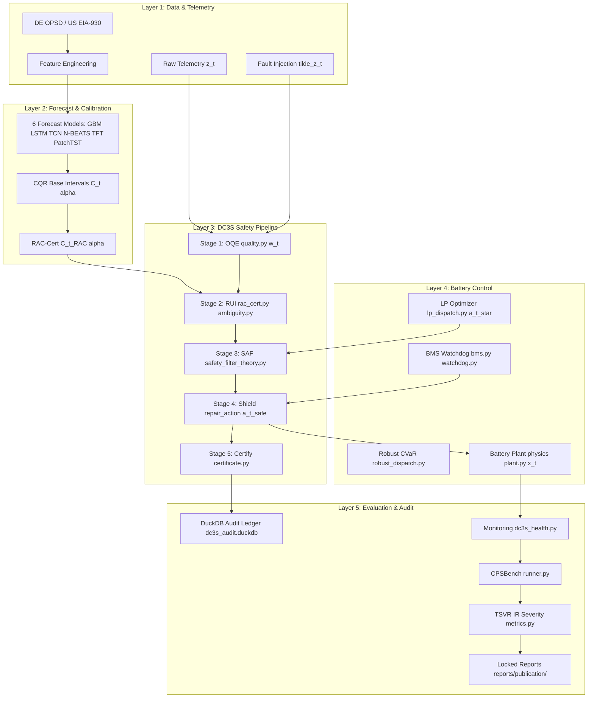
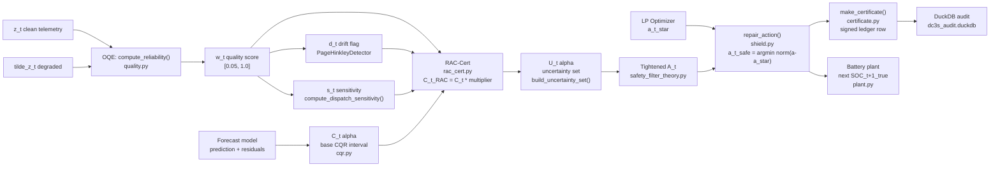

# ORIUS Battery Framework — Phase 2: Framework Architecture

**Status**: Architecture documented. All layers mapped to confirmed repo modules.

---

## 1. Five-Layer ORIUS Framework



---

## 2. Runtime Data Flow (step-by-step)



---

## 3. Module Responsibility Table

| Module | Package path | Responsibility | Theorem ref | Config |
|--------|-------------|----------------|-------------|--------|
| OQE (quality) | `src/orius/dc3s/quality.py` | Compute `w_t` from staleness, missingness, out-of-order, spike evidence | A2, A6 | `dc3s.reliability.*` |
| FTIT | `src/orius/dc3s/ftit.py` | Fault-tolerant interval tracking; accumulate fault evidence `d_t` | A6 | `dc3s.ftit.*` |
| Drift detector | `src/orius/dc3s/drift.py` | Page-Hinkley online drift detection; trigger recalibration | A5, A6 | `dc3s.drift.*` |
| RAC-Cert | `src/orius/dc3s/rac_cert.py` | Inflate base conformal interval to `C_t^RAC`; compute `s_t` sensitivity | A5, T3 | `dc3s.rac_cert.*` |
| Ambiguity / RUI | `src/orius/dc3s/ambiguity.py` | `widen_bounds()` — applies `λ·(1−w_t)` inflation to prediction intervals | A5 | `dc3s.ambiguity.*` |
| Calibration | `src/orius/dc3s/calibration.py` | Build `U_t(α)` uncertainty set from inflated interval | A5 | `dc3s.alpha0` |
| SAF (theory) | `src/orius/dc3s/safety_filter_theory.py` | Compute tightened SOC bounds and `A_t`; verify one-step feasibility | A3, T2 | `dc3s.shield.*` |
| Shield | `src/orius/dc3s/shield.py` | Project `a_t^*` onto `A_t`; emit `a_t^safe`; CVaR fallback | A3, A8, T2 | `dc3s.shield.*` |
| Certificate | `src/orius/dc3s/certificate.py` | Sign and store certificate; compute model/config hashes | A7 | `dc3s.audit.*` |
| Coverage theorem | `src/orius/dc3s/coverage_theorem.py` | Verify T3 marginal/conditional coverage guarantee | T3 | `dc3s.alpha0` |
| Guarantee checks | `src/orius/dc3s/guarantee_checks.py` | `next_soc()` — one-step SOC feasibility check; T2 operational check | T2 | — |
| DC3S state | `src/orius/dc3s/state.py` | `DC3SState` dataclass + DuckDB state persistence | — | `dc3s.audit.*` |
| DC3S entry | `src/orius/dc3s/__init__.py` | `run_dc3s_step()` — full one-step pipeline | all | all |
| LP dispatch | `src/orius/optimizer/lp_dispatch.py` | LP-based battery dispatch; produce `a_t^*` | A4 | `configs/optimization.yaml` |
| Robust dispatch | `src/orius/optimizer/robust_dispatch.py` | CVaR robust dispatch under forecast uncertainty | A4 | `configs/optimization.yaml` |
| Battery plant | `src/orius/cpsbench_iot/plant.py` | Physics truth model: true SOC evolution | A4 | plant params |
| Scenarios | `src/orius/cpsbench_iot/scenarios.py` | Fault injection (dropout, stale, jitter, spike, compound) | T1, T4 | `configs/cpsbench_r1_severity.yaml` |
| CPSBench runner | `src/orius/cpsbench_iot/runner.py` | Orchestrate full benchmark: fault episodes × controllers | T1–T4 | same |
| Metrics | `src/orius/cpsbench_iot/metrics.py` | TSVR, IR, severity, cost, carbon | T3 | — |
| Forecast (GBM) | `src/orius/forecasting/ml_gbm.py` | LightGBM training/inference | — | `configs/forecast.yaml` |
| Forecast (DL) | `src/orius/forecasting/dl_*.py` | LSTM, TCN, N-BEATS, TFT, PatchTST | — | `configs/forecast.yaml` |
| CQR | `src/orius/forecasting/uncertainty/cqr.py` | Split conformal + CQR base intervals | T3 | `configs/uncertainty.yaml` |
| Reliability Mondrian | `src/orius/forecasting/uncertainty/reliability_mondrian.py` | Reliability-stratified conditional coverage | T3 | `configs/uncertainty.yaml` |
| Feature pipeline | `src/orius/data_pipeline/build_features.py` | Feature engineering for DE OPSD | — | `configs/data.yaml` |
| Feature pipeline (US) | `src/orius/data_pipeline/build_features_eia930.py` | Feature engineering for US EIA-930 | — | `configs/forecast_eia930.yaml` |
| Monitoring | `src/orius/monitoring/dc3s_health.py` | Certificate validity, coverage, drift health checks | T3 | `configs/monitoring.yaml` |
| Streaming | `src/orius/streaming/worker.py` | Per-message DC3S step via Kafka | — | `configs/streaming.yaml` |
| FastAPI | `services/api/routers/dc3s.py` | `/dc3s/step`, `/dc3s/state` REST endpoints | — | `configs/serving.yaml` |
| HIL simulator | `iot/edge_agent/drivers/sim.py` | `SimBatteryDriver` — physics-based software HIL | — | `configs/iot.yaml` |
| BMS | `src/orius/safety/bms.py` | Hard SOC / temperature / current safety envelope | A3 | BMS config |

---

## 4. Stack Decisions

| Concern | Decision | Rationale |
|---------|----------|-----------|
| Language | Python 3.11 | Required: `pyproject.toml` specifies `>=3.11,<3.12` |
| ML framework | LightGBM 4.6.0 (primary), PyTorch (DL models) | GBM is strongest baseline on locked datasets |
| Optimization | HiGHS 1.8.1 via `highspy`, Pyomo 6.8.2 | LP dispatch; Pyomo wraps HiGHS for robust/scenario MPC |
| Uncertainty | Custom CQR + conformal in `forecasting/uncertainty/` | No external conformal lib; leakage-safe walk-forward |
| State / audit DB | DuckDB 1.4.4 | `data/audit/dc3s_audit.duckdb` — zero-dependency embedded OLAP |
| API service | FastAPI 0.128.0 | `services/api/` — REST endpoints for DC3S, forecast, dispatch |
| Streaming | Kafka (via `configs/streaming.yaml`) | `streaming/consumer.py` + `worker.py` |
| Monitoring | Prometheus + AlertManager | `docker/prometheus/`, `monitoring/prometheus_metrics.py` |
| Containers | Docker + docker-compose | `docker/Dockerfile.api`, `docker/docker-compose.full.yml` |
| Frontend | Next.js 14 TypeScript | `frontend/` — dashboard (separate from ML stack) |
| Config management | PyYAML 6.0.3 + `utils/config.py` | All configs in `configs/*.yaml`; loaded via `OmegaConf`-style |
| Reproducibility | `reports/publish/reproducibility_lock.json` + seed management in `utils/seed.py` | Deterministic seeds per run |
| Experiment tracking | MLFlow / manifest-based (no W&B dependency locked) | `registry/model_store.py`, `utils/manifest.py` |

---

## 5. DC3S Config Parameters (actual values from `configs/dc3s.yaml`)

| Parameter | Key | Value | Meaning |
|-----------|-----|-------|---------|
| α (base coverage) | `dc3s.alpha0` | 0.10 | Target coverage level for conformal |
| α_min | `dc3s.alpha_min` | 0.02 | Minimum alpha after RAC inflation |
| κ_r (quality weight) | `dc3s.k_quality` | 0.2 | RUI scaling for (1 − w_t) |
| κ_d (drift weight) | `dc3s.k_drift` | 0.0 | RUI scaling for d_t (disabled — tune in hardening) |
| κ_s (sensitivity weight) | `dc3s.k_sensitivity` | 0.4 | RUI scaling for s_t |
| infl_max | `dc3s.infl_max` | 2.0 | Maximum inflation multiplier |
| beta_reliability | `dc3s.beta_reliability` | 0.7 | RAC-Cert reliability weight |
| beta_sensitivity | `dc3s.beta_sensitivity` | 0.5 | RAC-Cert sensitivity weight |
| min_w | `dc3s.reliability.min_w` | 0.05 | Floor for w_t (enforces A2) |
| shield mode | `dc3s.shield.mode` | projection | L2 projection repair (enforces A3) |
| reserve_soc_pct_drift | `dc3s.shield.reserve_soc_pct_drift` | 0.08 | SOC buffer for drift regime |
| PH delta | `dc3s.drift.ph_delta` | 0.01 | Page-Hinkley sensitivity |
| PH lambda | `dc3s.drift.ph_lambda` | 5.0 | Page-Hinkley threshold |
| FTIT decay | `dc3s.ftit.decay` | 0.98 | Fault evidence EMA decay |
| Audit DB | `dc3s.audit.duckdb_path` | `data/audit/dc3s_audit.duckdb` | Certificate ledger path |

---

## 6. Key Integration Points

### DC3S pipeline entry point
```python
# src/orius/dc3s/__init__.py
from orius.dc3s import run_dc3s_step

result = run_dc3s_step(
    event=telemetry_event,          # TelemetryEvent from streaming/schemas.py
    state=dc3s_state,               # DC3SState from dc3s/state.py
    candidate_action=a_star,        # MW from optimizer/lp_dispatch.py
    forecast_intervals=intervals,   # (lower, upper) from forecasting/uncertainty/cqr.py
    cfg=dc3s_cfg,                   # loaded from configs/dc3s.yaml
)
# result contains: w_t, C_t_RAC, U_t, a_safe, certificate
```

### FastAPI endpoint (production)
```
POST /dc3s/step
  body: { event, state_id, candidate_action, forecast_intervals }
  response: { w_t, a_safe, certificate_id, violation_flag }
```

### CPSBench integration
```python
# src/orius/cpsbench_iot/runner.py
runner = CPSBenchRunner(config=cpsbench_cfg)
results = runner.run(scenarios=['dropout', 'stale', 'delay_jitter', 'spikes', 'drift_combo'])
# results written to reports/publication/cpsbench_merged_sweep.csv
```

---

*Next: see `03-env-and-repro.md` for environment setup and reproducibility guarantees.*
