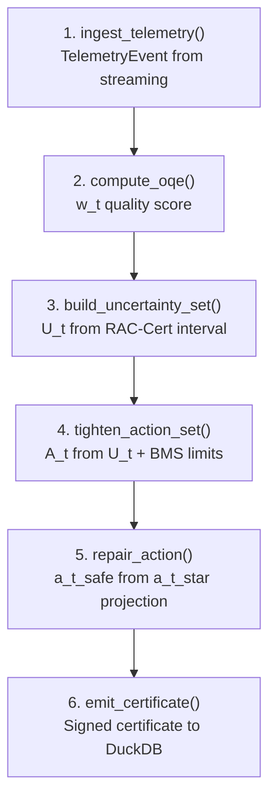
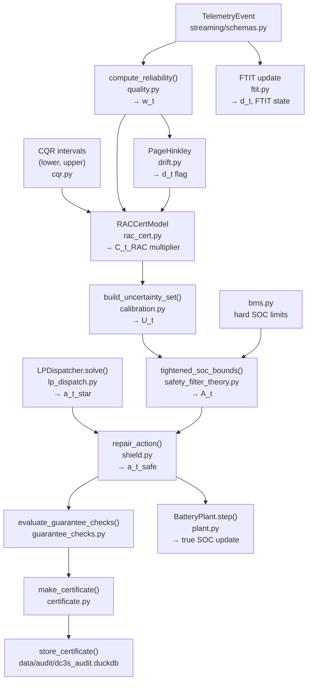

# ORIUS Battery Framework — Phase 5: Battery Domain Adapter & Control Stack

**Status**: All adapter components implemented. Interface documented. Region configs confirmed.

---

## 1. Battery Domain Adapter Overview

The `BatteryDomainAdapter` is the bridge between raw battery telemetry and the ORIUS DC3S safety pipeline. It has six responsibilities in sequence:



The existing repo implements all six as separate callable functions (not a single class). The entry point is `src/orius/dc3s/__init__.py` → `run_dc3s_step()`.

---

## 2. Six Adapter Methods

### Method 1: `ingest_telemetry()`

**File**: `src/orius/streaming/schemas.py`

Converts raw Kafka message or HTTP payload into a typed `TelemetryEvent`:

```python
from orius.streaming.schemas import TelemetryEvent

event = TelemetryEvent(
    device_id="battery-001",
    zone_id="DE-central",
    timestamp="2026-03-15T08:00:00Z",
    value=142.5,         # current SOC in MWh
    target="soc_mwh",    # signal name
)
```

In CPSBench / simulation: the fault scenarios in `cpsbench_iot/scenarios.py` degrade the telemetry before it enters the pipeline (simulating `tilde_z_t`).

---

### Method 2: `compute_oqe()` — Observation Quality Estimation

**File**: `src/orius/dc3s/quality.py` → `compute_reliability(event, last_event, cfg)`

**Formula**:
```
w_t = max(w_min, p_miss · p_delay · p_ooo · p_spike)
```

| Factor | Condition | Effect on w_t |
|--------|-----------|--------------|
| `p_miss` | `event.value` is NaN | → 0.0 |
| `p_delay` | timestamp gap > `expected_cadence_s` | → decays exponentially with `lambda_delay = 0.002` |
| `p_ooo` | event timestamp < last timestamp | → multiplied by `1 - ooo_gamma = 0.65` |
| `p_spike` | `|value - last_value|` exceeds range | → multiplied by `1 - spike_beta = 0.75` |

**Config** (`configs/dc3s.yaml`):
```yaml
dc3s:
  expected_cadence_s: 3600     # 1-hour cadence
  reliability:
    lambda_delay: 0.002
    spike_beta: 0.25
    ooo_gamma: 0.35
    min_w: 0.05
```

**Output**: `w_t ∈ [0.05, 1.0]`

---

### Method 3: `build_uncertainty_set()` — RAC-Cert Inflation

**Files**:
- `src/orius/dc3s/rac_cert.py` → `compute_q_multiplier()`, `RACCertModel`
- `src/orius/dc3s/ambiguity.py` → `widen_bounds()`
- `src/orius/dc3s/calibration.py` → `build_uncertainty_set()`

**Formula**:
```
C_t^RAC(α) = C_t(α) · [1 + κ_r·(1 − w_t) + κ_d·d_t + κ_s·s_t]
```

**Config**:
```yaml
dc3s:
  k_quality: 0.2        # κ_r
  k_drift: 0.0          # κ_d (currently disabled; tune in hardening)
  k_sensitivity: 0.4    # κ_s
  infl_max: 2.0         # global inflation cap
  rac_cert:
    max_q_multiplier: 3.0
    beta_reliability: 0.7
    beta_sensitivity: 0.5
    k_sensitivity: 0.4
  ambiguity:
    min_w: 0.05
    max_extra: 1.0
```

**Output**: `U_t = (lower_bound_mwh, upper_bound_mwh)` — box in SOC space

---

### Method 4: `tighten_action_set()` — SAF Set Construction

**File**: `src/orius/dc3s/safety_filter_theory.py` → `tightened_soc_bounds()`

Given:
- `U_t` uncertainty set
- BMS hard limits (`SOC_min`, `SOC_max`)
- Reserve buffer (drift regime: `reserve_soc_pct_drift = 0.08`)

Returns: tightened `A_t` — the feasible dispatch range (MW) that guarantees next SOC stays within bounds even if true SOC lies anywhere in `U_t`.

**Config**:
```yaml
dc3s:
  shield:
    reserve_soc_pct_drift: 0.08   # 8% buffer in drift regime
    mode: projection
```

---

### Method 5: `repair_action()` — Shield / Projection

**File**: `src/orius/dc3s/shield.py` → `repair_action(a_star, state, uncertainty_set, constraints, cfg)`

**Formula**:
```
a_safe = argmin_{a ∈ A_t} ‖a − a_star‖₂
```

Two repair modes:
1. **Projection** (default): L2 projection onto the intersection of `A_t` and power/ramp bounds
2. **CVaR fallback**: If projection fails, run CVaR robust dispatch (`optimizer/robust_dispatch.py`)

**Config**:
```yaml
dc3s:
  shield:
    mode: projection
    cvar:
      beta: 0.90          # CVaR confidence level
      n_scenarios: 20     # scenario count for robust fallback
      scenario_seed: 0    # deterministic seed
```

**Intervention detection**: `intervened = (a_safe != a_star)`. When `True`, the certificate records `intervention_reason` (e.g., "soc_bound", "power_bound", "ramp_bound").

---

### Method 6: `emit_certificate()` — Certification & Audit

**File**: `src/orius/dc3s/certificate.py` → `make_certificate()` + `store_certificate()`

Emits a signed, content-addressed certificate per dispatch step and writes it to DuckDB.

**Key certificate fields** (see `04-core-apis.md` §2 for full schema):
- `certificate_hash`: SHA256 of canonical JSON payload
- `prev_hash`: links to previous certificate (tamper-evident chain)
- `model_hash`: SHA256 of model artifact bytes
- `config_hash`: SHA256 of `dc3s.yaml` at run time
- `assumptions_version`: `"dc3s-assumptions-v1"`

**Storage**: `data/audit/dc3s_audit.duckdb` → `dispatch_certificates` table

---

## 3. Battery Plant Physics (Truth Model)

From `src/orius/cpsbench_iot/plant.py` → `BatteryPlant`:

```python
@dataclass
class BatteryPlant:
    soc_mwh: float          # current true SOC
    min_soc_mwh: float      # hard lower wall
    max_soc_mwh: float      # hard upper wall
    charge_eff: float       # η_c
    discharge_eff: float    # η_d
    dt_hours: float = 1.0   # Δt

    def step(self, charge_mw: float, discharge_mw: float) -> float:
        # SOC_{t+1} = SOC_t + (η_c · [a]+ - [a]-/η_d) · Δt
        # NO CLAMPING — allows violations to be measured
        ...

    def violation(self) -> dict:
        # Returns {"violated": bool, "severity_mwh": float}
        ...
```

**Critical design**: `BatteryPlant.step()` **never clamps** SOC. This is intentional — it allows the CPSBench to measure true-state violations that would occur if no safety layer is present.

### Physical parameters used in locked runs

| Parameter | Symbol | Value | Source |
|-----------|--------|-------|--------|
| Energy capacity | E_max | Set per scenario | `cpsbench_r1_severity.yaml` |
| Charge efficiency | η_c | 0.95 (typical) | plant config |
| Discharge efficiency | η_d | 0.95 (typical) | plant config |
| Time step | Δt | 1.0 hour | `dc3s.ftit.dt_hours = 1.0` |
| Telemetry cadence | — | 3600 s | `dc3s.expected_cadence_s = 3600` |

---

## 4. Fault Types (Scenario Definitions)

From `src/orius/cpsbench_iot/scenarios.py`:

| Fault name | Scenario key | What it does | Column in x_obs |
|------------|-------------|-------------|----------------|
| No fault | `nominal` | Clean telemetry | all zeros |
| Packet dropout | `dropout` | Randomly drops measurements (NaN) | `dropout` |
| Delay jitter | `delay_jitter` | Adds random latency to timestamps | `delay_jitter` |
| Out-of-order | `out_of_order` | Reorders event timestamps | `out_of_order` |
| Spikes | `spikes` | Adds outlier values to measurements | `spikes` |
| Drift combo | `drift_combo` | Combined covariate + label drift | `covariate_drift` + `label_drift` |
| Stale sensor | `stale_sensor` | Repeats last measurement for `k` steps | `stale_sensor` |

**Default scenario set**: `("nominal", "dropout", "delay_jitter", "out_of_order", "spikes", "drift_combo")`

### Episode generation
```python
from orius.cpsbench_iot.scenarios import generate_episode

artifacts = generate_episode(
    scenario="dropout",
    horizon=8760,      # 1 year of hourly data
    seed=42,
)
# artifacts.x_obs: DataFrame with degraded telemetry (tilde_z_t)
# artifacts.x_true: DataFrame with clean telemetry (z_t)
# artifacts.event_log: DataFrame with fault active/inactive per step
```

---

## 5. Battery Optimizer: LP Dispatch

From `src/orius/optimizer/lp_dispatch.py` → `LPDispatcher`:

### LP formulation
Minimize cost (or maximize revenue) subject to:

**Power bounds**: `-P_max ≤ a_t ≤ P_max`

**Ramp bounds**: `|a_t − a_{t-1}| ≤ R_max`

**SOC feasibility** (one-step): `SOC_min ≤ SOC_t + (η_c·[a]+ − [a]-/η_d)·Δt ≤ SOC_max`

Implemented via **HiGHS 1.8.1** solver (via `highspy`) + **Pyomo 6.8.2** modeling.

### Robust dispatch variant
`src/orius/optimizer/robust_dispatch.py` → adds forecast uncertainty as box uncertainty set (conservative).

### CVaR scenario dispatch
`src/orius/optimizer/scenario_robust_dispatch.py` → scenario tree with `n_scenarios=20` Monte Carlo samples.

---

## 6. Region Configurations

### DE OPSD (Germany)

| Config | File |
|--------|------|
| Forecast training | `configs/forecast.yaml` |
| Seeds | `[42, 123, 456, 789, 2024, 1337, 7777, 9999]` |
| Targets | `load_mw`, `wind_mw`, `solar_mw` |
| Data path | `data/raw/opsd/` |
| Feature build | `src/orius/data_pipeline/build_features.py` |
| Locked results | `reports/impact_summary.csv` (DE), `reports/research_metrics_de.csv` |

### US EIA-930 — MISO, PJM, ERCOT

| Config | File |
|--------|------|
| Forecast training (MISO) | `configs/forecast_eia930.yaml` |
| ERCOT variant | `configs/train_forecast_ercot.yaml` |
| PJM variant | `configs/train_forecast_pjm.yaml` |
| Seeds | `[42, 123, 456, 789, 2024]` |
| Data path | `data/raw/eia930/` |
| Feature build | `src/orius/data_pipeline/build_features_eia930.py` |
| Locked results | `reports/research_metrics_us.csv` |

### Adding a new region

1. Copy `configs/train_forecast_template.yaml` → `configs/train_forecast_<region>.yaml`
2. Update `data_path`, `target_cols`, `seeds`, `zone_id`
3. Create feature builder or extend `build_features_eia930.py`
4. Run `python scripts/train_dataset.py --config configs/train_forecast_<region>.yaml`
5. Add region to `reports/impact_comparison.json` and update `impact_comparison.md`

---

## 7. DC3S ↔ Battery Control: Full Integration Diagram



---

## 8. FTIT — Fault-Tolerant Interval Tracking

From `src/orius/dc3s/ftit.py`:

FTIT accumulates evidence of **fault type**, **severity**, and **duration** across multiple timesteps using exponential moving averages.

**FTIT parameters** (from `dc3s.yaml`):
```yaml
ftit:
  decay: 0.98            # main EMA decay
  decay_e: 0.95          # energy-level EMA decay
  dt_hours: 1.0          # time step
  stale_k: 3             # steps before marking as stale
  stale_tol: 1.0e-9      # tolerance for stale detection
  alpha_dropout: 1.0     # dropout evidence weight
  alpha_stale_sensor: 1.0
  alpha_delay_jitter: 1.0
  alpha_out_of_order: 1.0
  alpha_spikes: 1.0
  sigma2_init: 1.0       # initial variance
  sigma2_decay: 0.95
  sigma2_floor: 1.0e-6
  delta: 0.05            # alarm threshold
  eps_interval: 1.0e-6
```

FTIT produces per-step fault type breakdown used in the CPSBench `dc3s_ftit` controller variant, which inflates intervals based on **which type** of fault is active, not just the overall `w_t`.

---

## 9. BMS Safety Envelope

From `src/orius/safety/bms.py` → `BatteryManagementSystem`:

Hard physical limits enforced as a final fallback:
- `SOC_min` / `SOC_max` — hard SOC walls
- Temperature limits (if sensor available)
- Current limits
- Watchdog timer: `src/orius/safety/watchdog.py` — if no action received within `max_staleness_s`, issue safe hold command

The BMS is the last line of defense. The DC3S `repair_action()` runs before the BMS check, so in normal operation BMS should never trigger. If it does, it indicates the DC3S shield failed to maintain `A3`.

---

*Next: see `06-certificates-and-forecasting.md` for the full forecasting → calibration → certificate pipeline.*
