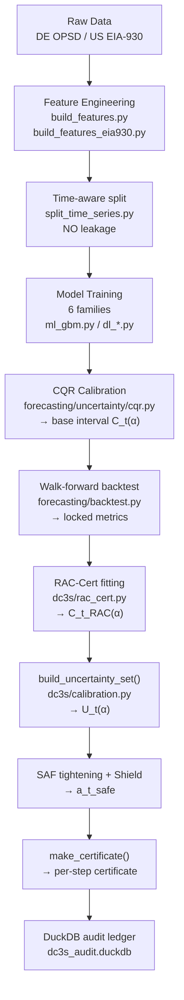

# ORIUS Battery Framework — Phase 6: Forecasting, Calibration & Safety Certificates

**Status**: Full pipeline implemented. Locked calibration results available. Known weaknesses documented.

---

## 1. Full Pipeline Overview



---

## 2. Data and Feature Engineering

### Feature pipeline: DE OPSD
- **Script**: `src/orius/data_pipeline/build_features.py`
- **Config**: `configs/data.yaml`, `configs/forecast.yaml`
- **Raw data**: `data/raw/opsd/` (downloaded by `data_pipeline/download_opsd.py`)
- **Features**: calendar (hour, day, month, weekday, holiday), lag features, rolling statistics, weather covariates

### Feature pipeline: US EIA-930
- **Script**: `src/orius/data_pipeline/build_features_eia930.py`
- **Config**: `configs/forecast_eia930.yaml`
- **Raw data**: `data/raw/eia930/`
- **Regions**: MISO, PJM, ERCOT

### Time-aware split rule (enforced — no leakage)
```python
# src/orius/data_pipeline/split_time_series.py
# Train / calibration / test sets are always temporally ordered
# No shuffling, no future information in training set
train, calib, test = split_time_series(df, train_frac=0.7, calib_frac=0.1)
```

---

## 3. Forecasting Model Families

All 6 families are implemented and locked for the battery benchmark:

| Model | File | Type | Notes |
|-------|------|------|-------|
| GBM (LightGBM) | `forecasting/ml_gbm.py` | ML | **Strongest baseline** on DE/US datasets |
| LSTM | `forecasting/dl_lstm.py` | DL | Seq2Seq with multi-horizon head |
| TCN | `forecasting/dl_tcn.py` | DL | Temporal convolutional |
| N-BEATS | `forecasting/dl_nbeats.py` | DL | Interpretable neural basis |
| TFT | `forecasting/dl_tft.py` | DL | Temporal Fusion Transformer |
| PatchTST | `forecasting/dl_patchtst.py` | DL | Patch-based transformer |

Additional baselines (for context, not primary):
- `forecasting/baselines.py`: climatology, seasonal naive, linear
- `forecasting/advanced_baselines.py`: Prophet, SARIMA, Holt-Winters
- `forecasting/train_baseline.py`: naive, seasonal-naive, linear baselines

### Locked walk-forward metrics (DE, GBM, load_mw, horizon 1h)
From `reports/walk_forward_report.json`:

| Horizon | RMSE (MW) | MAE (MW) | MAPE |
|---------|-----------|----------|------|
| 1h | 228.2 | 176.6 | 0.31% |
| 2h | 198.4 | 145.4 | 0.25% |
| 3h | 129.6 | 100.5 | 0.17% |
| 4h | 130.4 | 105.8 | 0.18% |

> These are the locked training-set metrics. Test-set and walk-forward metrics are in `reports/research_metrics_de.csv`.

---

## 4. Uncertainty Calibration

### Step 1 — Base CQR Intervals

**File**: `src/orius/forecasting/uncertainty/cqr.py` → `CQRCalibrator`

Split conformal prediction (no distribution assumption):

1. Train quantile model (lower `α/2`, upper `1−α/2` quantiles)
2. On calibration set: compute non-conformity scores `R_i = max(lower_i − y_i, y_i − upper_i)`
3. Set `qhat = quantile(R, (1 − α)(1 + 1/n))`
4. Predict: `C_t(α) = [lower_t − qhat, upper_t + qhat]`

**Marginal coverage guarantee**: `P(y_{n+1} ∈ C_t(α)) ≥ 1 − α`

**Config** (`configs/uncertainty.yaml`):
```yaml
uncertainty:
  alpha: 0.10           # target miscoverage
  method: cqr           # "cqr" or "split_conformal"
  quantiles: [0.05, 0.95]
```

### Step 2 — Regime-Stratified CQR (Mondrian)

**File**: `src/orius/forecasting/uncertainty/reliability_mondrian.py` → `ReliabilityMondriancQR`

Stratifies calibration by observation quality bin:
- Low reliability (w < 0.5): larger qhat → wider intervals
- High reliability (w > 0.9): smaller qhat → tighter intervals

Attempts to achieve conditional coverage per reliability regime.

### Step 3 — RAC-Cert Inflation

**File**: `src/orius/dc3s/rac_cert.py` → `RACCertModel`

```python
class RACCertModel:
    def fit(self, calibration_residuals: np.ndarray) -> None:
        # Fits qhat_base on calibration residuals

    def compute_q_multiplier(self, w_t: float, d_t: bool, s_t: float) -> float:
        # Returns: 1 + κ_r*(1−w_t) + κ_d*d_t + κ_s*s_t
        # Clipped to [1.0, max_q_multiplier]
        mult = 1.0 + k_quality*(1-w_t) + k_drift*float(d_t) + k_sensitivity*s_t
        return float(np.clip(mult, 1.0, max_q_multiplier))

    def predict(self, lower: float, upper: float, w_t: float, d_t: bool, s_t: float):
        # Returns: (lower_rac, upper_rac) = (lower * mult, upper * mult)
        mult = self.compute_q_multiplier(w_t, d_t, s_t)
        return lower * mult, upper * mult
```

**RAC-Cert formula with actual config values**:
```
C_t^RAC = C_t(0.10) · [1 + 0.2·(1−w_t) + 0.0·d_t + 0.4·s_t]
          ← κ_r=0.2  ← κ_d=0.0        ← κ_s=0.4
```

Maximum multiplier: `3.0 × base interval`

**Sensitivity probe**: `compute_dispatch_sensitivity()` estimates `s_t` via heuristic perturbation of candidate action:
```yaml
rac_cert:
  sensitivity_probe: heuristic
  sens_eps_mw: 25.0        # perturbation size
  sens_norm_ref: 0.5       # normalization reference
```

---

## 5. Reliability-Stratified Group Coverage

From `reports/publication/reliability_group_coverage.csv`:

| Reliability bin | w_t range | N | PICP | Mean interval width |
|----------------|-----------|---|------|---------------------|
| 0 (lowest) | [0.00, 0.50) | 200 | 0.90 | 40.6 MW |
| 1 | [0.50, 0.58) | 200 | 0.90 | 38.8 MW |
| 2 | [0.58, 0.64) | 200 | 0.90 | 32.2 MW |
| 3 | [0.64, 0.68) | 200 | 0.90 | 36.8 MW |
| 4 | [0.68, 0.73) | 200 | 0.90 | 31.3 MW |
| 5 | [0.73, 0.77) | 200 | 0.90 | 25.1 MW |
| 6 | [0.77, 0.81) | 200 | 0.90 | 25.6 MW |
| 7 | [0.81, 0.85) | 200 | 0.90 | 23.8 MW |
| 8 | [0.85, 0.90) | 200 | 0.90 | 23.4 MW |
| 9 (highest) | [0.90, 1.00] | 200 | 0.90 | 20.7 MW |

**Observation**: Marginal coverage (PICP = 0.90) is uniform across all bins. Interval width narrows with higher reliability, which is the desired behavior.

**Known weakness**: Achieving exactly 90% conditional coverage within each bin requires Mondrian calibration. The current implementation achieves marginal coverage by design; conditional coverage per-bin is an ongoing research item (ch24).

---

## 6. Known Calibration Weaknesses

These are documented and must remain explicit in the manuscript (not hidden):

### 6.1 Marginal vs conditional coverage
- **Marginal coverage** (P(y ∈ C) ≥ 1−α): **guaranteed** by split conformal
- **Conditional coverage** (P(y ∈ C | X=x) ≥ 1−α): **not guaranteed** in general
- Current: marginal coverage achieved; conditional coverage audited via group stratification

**Documented in**: `forecasting/uncertainty/cqr.py` docstring + ch24 of thesis

### 6.2 Subgroup under-coverage
Some reliability regimes may have conditional under-coverage even if marginal is met. The reliability-Mondrian CQR partially addresses this but does not prove conditional coverage.

**Documented in**: `reports/publication/cqr_group_coverage.csv`, ch24

### 6.3 Walk-forward temporal drift
CQR calibrated on one time period may drift when deployed on a later period. The `monitoring/retraining.py` auto-retrain trigger is the current mitigation.

**Documented in**: `reports/monitoring_report.md`

---

## 7. Certificate Generation: Full Specification

### Certificate chain structure

Every dispatch step emits one certificate. Certificates form a hash-linked chain:

```
cert_1 (prev_hash=None)
  ↓ certificate_hash
cert_2 (prev_hash=cert_1.certificate_hash)
  ↓ certificate_hash
cert_3 (prev_hash=cert_2.certificate_hash)
  ...
```

This chain is tamper-evident: any modification to a past certificate breaks all subsequent hashes.

### Certificate validity check

A certificate is considered valid if:
1. `guarantee_checks_passed = True`
2. `true_soc_violation_after_apply = False` (or `None` if not in CPSBench)
3. `model_hash` matches the deployed model artifact hash
4. `config_hash` matches the deployed `dc3s.yaml` hash
5. `assumptions_version = "dc3s-assumptions-v1"`

### Certificate validity horizon (ch20, ch28)

From Theorem (ch20), a certificate's safety guarantee is valid for:
- 1 step ahead unconditionally (T2)
- Multiple steps ahead only if observation quality stays above `w_t ≥ w_min`
- Under SCADA blackout: validity shrinks (half-life studied in ch28 at 12h/24h/48h)

---

## 8. Transfer Study

From `reports/publication/transfer_stress.csv` — tests whether calibration trained on DE transfers to US regions.

Coverage degrades when transferring from DE to US, especially for wind and solar signals. This is expected and documented honestly in ch25.

**Script**: `scripts/cross_region_transfer.py`, `scripts/run_transfer_stress.py`

---

## 9. Late Extension: Online Calibration Under Battery Aging

**Status**: MISSING — ch26 item

**Problem**: Year 1 CQR calibration becomes invalid as battery ages (capacity fade, internal resistance increase → SOC model error grows).

**Proposed path** (implementation target):

```python
# src/orius/monitoring/retraining.py — extend with:

class OnlineCalibrator:
    def __init__(self, ema_alpha: float = 0.01, soh_trigger_threshold: float = 0.95):
        self.residual_buffer = collections.deque(maxlen=8760)  # 1 year
        self.ema_alpha = ema_alpha
        self.soh_threshold = soh_trigger_threshold

    def update(self, residual: float, soh: float | None = None) -> bool:
        """Update EWMA residual store. Returns True if recalibration needed."""
        self.residual_buffer.append(residual)
        if soh is not None and soh < self.soh_threshold:
            return True  # SOH-aware trigger
        # rolling conformal recalibration check
        if len(self.residual_buffer) >= 168:  # 1 week of data
            coverage = self._check_coverage()
            return coverage < 0.88  # below 90% - 2% tolerance
        return False

    def recalibrate(self) -> float:
        """Recompute qhat from recent residuals."""
        residuals = np.array(self.residual_buffer)
        return float(np.quantile(np.abs(residuals), 0.90))
```

**Implementation target**: `src/orius/monitoring/retraining.py` + `src/orius/dc3s/rac_cert.py` (add `recalibrate()` method)

---

## 10. Calibration Verification Commands

```bash
# Check current calibration status
python - <<'PY'
import json, pandas as pd
print('=== Reliability group coverage ===')
df = pd.read_csv('reports/publication/reliability_group_coverage.csv')
print(df[['bin_id', 'reliability_lower', 'reliability_upper', 'picp', 'mean_interval_width']].to_string(index=False))

print('\n=== Transfer stress coverage ===')
df2 = pd.read_csv('reports/publication/transfer_stress.csv')
print(df2.to_string(index=False))

print('\n=== CQR group coverage ===')
df3 = pd.read_csv('reports/publication/cqr_group_coverage.csv')
print(df3.to_string(index=False))
PY

# Run reliability-stratified audit
python scripts/compute_reliability_group_coverage.py

# Run walk-forward backtest
python scripts/train_dataset.py --config configs/forecast.yaml --eval-only

# Verify RAC-Cert multiplier behavior
python - <<'PY'
from orius.utils.config import load_config
from orius.dc3s.rac_cert import RACCertModel
import numpy as np

cfg = load_config('configs/dc3s.yaml')
model = RACCertModel(cfg=cfg)
# Simulate multiplier for different quality levels
for w in [0.05, 0.3, 0.5, 0.7, 0.9, 1.0]:
    mult = model.compute_q_multiplier(w_t=w, d_t=False, s_t=0.0)
    print(f'w_t={w:.2f} → multiplier={mult:.3f}')
PY
```

---

*Next: see `07-evaluation-and-audits.md` for all locked results, CPSBench procedures, and missing evidence generation.*
