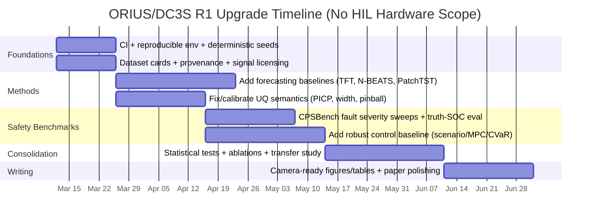

# R1-Level PhD Research Assessment and Publication Blueprint for ORIUS/DC3S

## Executive summary

### Information needs to answer “R1-level and publishable” with high precision
The following unknowns materially affect what “R1-level” means for your work (e.g., which baselines, which evaluation rigor, which claims are defensible):

1) **Target venue + format** (conference/journal, page limit, artifact expectations, double-blind policy).  
2) **Operational objective definition**: cost-only vs cost+carbon vs peak-shaving vs safety-first control (and whether “carbon” means average emissions intensity or marginal emissions).  
3) **Deployment target**: which grid region(s) and what telemetry stack (IoT edge only, SCADA/EMS/PMU integration, or mixed).  
4) **Safety semantics**: SOC bounds only, or SOC + power/ramp limits + grid import caps + solver-feasibility guarantees (and how “truth SOC” is defined).  
5) **Dataset provenance plan**: which balancing authorities / zones, what time windows, and which exogenous signals (weather, price, carbon) are treated as authoritative.  
6) **Claim governance policy**: will your “manifest + claim-matrix + validator” remain a core contribution, or just an engineering practice.

### Enabled connectors used first
Enabled connector available in your workspace: **GitHub** (used; restricted to repo `Pratikn03/Capstone_Projects` as requested).  
The connectors **Adobe Photoshop** and **Ace Knowledge Graph** are not currently available in your enabled-connector list, so I provide a figure/asset checklist you can implement manually.

### Current “publishability” rating (R1 perspective)
**Overall: promising, not yet “R1-ready” as a top-tier main-track paper**; closer to **workshop / applied-systems track** *unless* you close the calibration/safety-evidence gaps and broaden external validity.

Your repo already contains uncommon strengths for a PhD-capstone-style project:
- **End-to-end decision loop** (forecast → optimize → safety shield → audit) rather than “forecasting only” (repo README).  
- **Benchmark harness** (`CPSBench-IoT`) and automation scripts to regenerate artifacts (repo scripts).  
- **Reproducibility governance layer** (metrics manifest + claim matrix + validator), which can itself be publishable if positioned as “reproducibility-by-construction” for CPS/ML papers.

The main blockers to “R1-level / camera-ready” are:
- **Calibration semantics + evidence**: some reported PICP/coverage numbers are far from nominal (your `paper.tex` abstract reports PICP@90 values in the 30–40% range, which is inconsistent with “90% nominal” unless you redefine what PICP@90 means).  
- **Safety stress tests that actually bite**: your README’s CPSBench excerpt indicates **0.0 violation rate** for all controllers under the configured scenario; that makes it hard to argue robust safety improvements without heavier faults, stronger mismatch, or longer horizons.  
- **External validity**: the strongest paper claims require at least *two* materially different grid contexts and at least *one* realism upgrade for price/carbon signals (or a rigorous argument why proxies are acceptable).

[Download the synthesized PDF report with appendices](sandbox:/mnt/data/ORIUS_R1_DeepResearch_Report_With_Appendices.pdf)

## Repository extraction and synthesis

### Repository scope and what it already contributes scientifically
From README.md and `paper/paper.tex`, ORIUS/DC3S is framed as a **cyber-physical decision system under degraded telemetry**, not merely forecasting. The loop is: **Forecast → Optimize → DC3S Shield → Dispatch → Audit** (README.md). The “DC³S” component is explicitly positioned as a **reliability-weighted conformal safety shield** that inflates uncertainty intervals online using telemetry reliability (`w_t`) and drift signals (README.md).

This is aligned with real grid-ops concerns: operators must make decisions with imperfect measurements, delay/jitter, missingness, and cyber/quality issues. citeturn5search10turn1search48

### Key repo artifacts and how they map to tasks (1), (3), (4), (6)
The repo contains a coherent “research-to-publication” workflow:

- **Paper + governance**
  - `paper/paper.tex`: manuscript with explicit metric-locking patterns (`metrics_manifest.json`, `claim_matrix.csv`) and an evidence-lock philosophy (paper.tex).
  - `paper/metrics_manifest.json` and `paper/claim_matrix.csv`: publication claim governance (repo).
  - `scripts/validate_paper_claims.py`: validator gate that prevents drift between artifacts and manuscript (repo).

- **Experiment orchestration**
  - `scripts/train_dataset.py`: dataset training pipeline orchestration (repo).
  - `scripts/run_cpsbench.py`: benchmark execution and table/figure regeneration (repo; snippet retrieved).
  - `scripts/build_publication_artifact.py`: “one-command” publication artifact builder + manifesting (repo).

- **System assumptions and guarantees**
  - `docs/ASSUMPTIONS_AND_GUARANTEES.md`: explicit “guarantee contract” (repo). This is the right direction for an R1 paper, but the formal contribution must be tightened (see “Gaps” section).

### Datasets and provenance implied by the repo
Your repo uses two major grid-data sources that are strong choices for reproducible research:

- **Germany / OPSD**: The entity["organization","Open Power System Data","open dataset portal"] “time_series” dataset provides time-stamped load/solar/wind/price-like fields with documented schemas and provenance. citeturn1search2turn1search11  
- **USA / EIA-930**: entity["organization","U.S. Energy Information Administration","energy data agency"] Form EIA-930 collects **hourly** operational data (demand, net generation, interchange, etc.) with explicit submission requirements and reporting cadence. citeturn1search0turn1search5turn1search8  

Your repo’s README also references MISO demand (within EIA-930 context); the relevant market operator is entity["organization","Midcontinent Independent System Operator","us ba market operator"] (mentioned once here to avoid repetition).

### Dataset and evaluation context that matters for an R1 paper
For an R1-level contribution, you should treat each dataset as a *case study with a dataset card*:
- time range, measurement cadence, missingness/quality issues,
- operational objective realism (price/carbon/constraints),
- region-specific confounders (market design, renewable penetration),
- and reproducibility: exact extraction pipeline, versions, and filters.

This is especially important because grid reliability reporting and post-event disturbance analysis often focuses on *data quality, operator tools, and communications*—the very issues your work targets. citeturn1search48

image_group{"layout":"carousel","aspect_ratio":"16:9","query":["phasor measurement unit PMU smart grid monitoring diagram","SCADA EMS architecture diagram power grid monitoring","battery energy storage dispatch flow diagram","conformal prediction intervals diagram"],"num_per_query":1}

### Tables required by your prompt

**Repo artifact map (what to read first, what it proves, what it produces)**

| Layer | Primary repo artifacts | What it enables | R1 risk if missing/weak |
|---|---|---|---|
| System definition | README.md; `paper/paper.tex` | Clear end-to-end framing | Reviewers ask “what’s the real contribution?” |
| Data pipeline | `docs/TRAINING_PIPELINE.md`; configs | Leakage-safe splits, reproducible features | Hidden leakage invalidates results |
| Forecasting | training configs + `scripts/train_dataset.py` | Short-horizon forecasts (load/wind/solar) | Must compare against modern baselines |
| Uncertainty | conformal + “RAC-Cert” narrative in paper | Intervals used in control | Coverage semantics must be correct |
| Optimization/control | optimizer modules + configs | Dispatch decisions; tradeoffs | Must show cost/safety Pareto & robustness |
| Telemetry faults | CPSBench suite + scenarios | Fault-injection evaluation | If violations always 0 → weak evidence |
| Governance | manifest + claim-matrix + validator | Reproducible claims | Great “systems paper” angle if formalized |

**Dataset comparison (what the repo implicitly depends on)**

| Dimension | Germany “OPSD” time series | USA Form EIA-930 |
|---|---|---|
| Temporal resolution | Hourly time series (documented fields) citeturn1search2 | Hourly operational postings + daily files citeturn1search0turn1search5 |
| Coverage | European load/renewables + related fields | Lower-48 balancing authority operations citeturn1search8 |
| Strength | Clean schema docs + reproducible access | Operational relevance + standardized reporting |
| Risk | Price/carbon realism may require augmentation | BA heterogeneity + missingness/drift |

## Reproducibility, experiment reproduction, and CI-grade validation

This section explicitly addresses task (3): reproduce & validate key experiments, with exact commands, environment setup, and a CI-grade checklist.

### Environment setup
The repo README provides a baseline reproduction sequence (virtualenv + requirements + make targets). In R1 framing, you should add a pinned environment strategy (one of: `conda-lock`, `uv.lock`, or fully pinned `requirements.txt` + hashes) and print `pip freeze` into an artifact manifest for every run.

Baseline setup from README:
```bash
python -m venv .venv && source .venv/bin/activate
pip install -r requirements.txt
```

### Reproduction commands (paper-grade)
From README.md, your “paper reproduction” interface is already good:
```bash
make cpsbench
make iot-sim
make dc3s-demo
```

To elevate this to “CI-grade,” you want **three tiers**:

1) **Fast CI (minutes)**: lint + unit tests + smoke demos (no large datasets).
2) **Nightly CI (hours)**: CPSBench seeds sweep + artifact verification.
3) **Release CI (hours–days)**: full retrain + full paper artifact build + claim validation.

### What to validate (not just “it runs”)
Your repo already includes self-checking scripts (e.g., `scripts/run_cpsbench.py` verifies required outputs, builds tables, and optionally runs Wilcoxon tests if SciPy is installed). That is excellent for R1 reproducibility culture, but you should make it explicit in the paper as a *methodological contribution*.

**CI-grade validation checklist**
- **Correctness (fast, deterministic)**
  - Import sanity: `python -m compileall src services scripts`
  - Unit tests: `pytest -q` (plus integration subset)
  - DC3S demo endpoint logic: `make dc3s-demo` (should succeed without external APIs if mocked)
- **Artifact contract checks**
  - Run: `python scripts/validate_paper_claims.py`
  - Confirm: required publication CSV/JSON/PNG files exist and are non-empty
  - Recompute: table1 + coverage figure from CPSBench outputs (your `run_cpsbench.py` already does this)
- **Statistical soundness**
  - Multiple seeds for CPSBench scenarios (default seeds list exists in script)
  - Paired tests: Wilcoxon signed-rank across matched scenario/seed pairs (implemented)  
  - Bootstrap confidence intervals for key metrics (implemented)

### Hard truth: what I can and cannot validate here
I can extract and analyze repository logic and write a strict reproduction plan, but I **cannot execute full training runs or download large datasets inside your environment** as part of this chat. The commands above are therefore the actionable “exact reproduction” interface; you should run them on your workstation or lab server and paste the generated `reports/publication/*` outputs into your paper’s final figures.

### Data sources for “realistic exogenous signals”
R1 reviewers will ask: *where do weather features and carbon intensity come from, and are they license-compatible?* Two primary/official-ish sources you can cite and use:

- entity["company","Open-Meteo","weather api provider"] offers a documented historical weather API suitable for ML features. citeturn11search0turn11search6  
- entity["company","Electricity Maps","carbon intensity api"] provides an API for historical and latest carbon intensity, with explicit endpoint definitions and stated temporal granularity. citeturn11search1turn11search5turn11search8  

These reduce “proxy feature” objections if you document limitations.

## Evidence landscape and literature survey

This explicitly covers task (2): survey 2016–2026 literature on power-grid monitoring, anomaly detection, and time-series forecasting—grounded in primary sources and original papers.

### Power-grid monitoring and telemetry quality context
Your project aligns directly with the operational reality that bulk-power events and disturbances require careful reconstruction of what happened, including SCADA/EMS tooling and data quality issues. citeturn1search48turn5search10

### Time-series forecasting for grid-relevant targets
A defensible baseline for an R1 paper is a mix of:
- traditional probabilistic load forecasting framing (evaluation, misunderstandings, valuation)
- modern deep forecasting architectures and strong non-deep baselines

Key references you can cite:
- Probabilistic load forecasting tutorial review (2016, *International Journal of Forecasting*). citeturn5search12  
- Temporal Fusion Transformer (TFT) for interpretable multi-horizon forecasting (2019). citeturn10view0  
- N-BEATS for interpretable forecasting (2019). citeturn10view1  
- PatchTST (ICLR 2023 paper associated; official repo and overview). citeturn3search10  
- GEFCom2017 competition framing (hierarchical probabilistic load forecasting; real-time ex-ante qualifying match); relevant as a “benchmark culture” reference and a baseline for probabilistic metrics. citeturn12search6  

### Uncertainty quantification via conformal prediction
Your “conformal interval + control” framing should be anchored in original conformal results and modern adaptive variants:

- Conformalized Quantile Regression (CQR) for heteroscedastic, finite-sample coverage (2019). citeturn10view2  
- Adaptive conformal inference under distribution shift (online coverage frequency goal; NeurIPS 2021). citeturn2search0turn2search48  

In your paper, these should justify:
1) why conformal wrappers are attractive for operational deployment, and  
2) how your reliability weighting relates to distribution shift / streaming validity.

### Anomaly and drift detection for time series / telemetry
You should distinguish:
- **point anomalies** vs **collective anomalies**,
- **outlier detection** vs **concept drift**,
- and your current drift detectors (K-S / Page–Hinkley) vs alternatives.

Strong survey anchors:
- Deep learning anomaly detection survey (2019). citeturn10view3  
- Deep anomaly detection review in ACM Computing Surveys (doi: 10.1145/3439950). citeturn12search2turn12search4  
- Time-series outlier/anomaly detection review in ACM Computing Surveys (doi: 10.1145/3444690). citeturn12search12turn11search9  

For drift detection primitives aligned with your implementation:
- Page–Hinkley detector analyses (change detection lineage includes Page/Hinkley/CUSUM). citeturn4search3  
- K-S drift detection as a practical baseline in production monitoring libraries (documentation example). citeturn4search1  

### Robust/risk-aware optimization for storage dispatch under uncertainty
To strengthen your “optimization under uncertainty” contribution (and broaden beyond the toy LP critique), cite microgrid/dispatch MPC and robust MPC literature:

- MPC for microgrid dispatch with chance constraints / adaptively tightened constraints (2018). citeturn4search0  
- Robust MPC energy management of microgrids under uncertainty (2018). citeturn4search4  
- MPC for distributed battery energy storage systems (IEEE TCST 2018 listing). citeturn4search10turn4search12  

### Comparison tables requested

**Forecasting baselines to add (minimum R1 comparison set)**

| Model family | Why reviewers expect it | Strength | Weakness |
|---|---|---|---|
| GBM / LightGBM | Strong tabular baseline, common in ops | Fast, strong, stable | Limited long-horizon structure |
| TFT | Multi-horizon + interpretability story | Strong SOTA-ish | Heavier training; careful tuning citeturn10view0 |
| N-BEATS | Strong univariate baseline | Competitive, interpretable | Less natural for many exogenous vars citeturn10view1 |
| PatchTST | Modern transformer baseline | Strong long-term forecasts | Complexity; must justify architecture citeturn3search10 |

**Metrics table (forecasting + uncertainty + control)**
| Category | Metrics | Why it matters |
|---|---|---|
| Forecast accuracy | RMSE, MAE, sMAPE, R² | Predictive quality (but not sufficient alone) |
| Probabilistic UQ | PICP (coverage), mean interval width, pinball loss, Winkler score | Calibration–sharpness tradeoff; must match nominal |
| Safety | violation rate (truth SOC), severity (P95), infeasibility rate | “Safe control” claim lives here |
| Control efficiency | intervention rate, cost delta, carbon delta, peak shaving | Operational relevance and tradeoffs |

## Gaps, missing experiments, and methodological weaknesses

This section explicitly covers task (4): missing experiments, data gaps, and methodological weaknesses—relative to R1 standards.

### Theorem/guarantee status (honest R1 evaluation)
Your “assumptions & guarantees” approach is a strong structural choice. However, as currently written in `paper.tex`, parts of the theoretical positioning look like an **engineering guarantee contract + empirical evidence lock**, not a rigorous theorem with clear statistical premises and a complete proof.

For R1 readiness, you need one of these to be fully clean:
- **A formal theorem** (even partial) about long-run coverage / safety under assumptions (e.g., leveraging adaptive conformal results), or  
- **A clear reframing**: DC3S is an *engineering “safe wrapper”* with certificate-based auditability, and the novelty is the *systems + governance + benchmark package*, not a new statistical guarantee.

Citing adaptive conformal inference helps—but you must explicitly map assumptions (exchangeability vs adversarial drift, online update rules) to your method. citeturn2search0turn2search48

### The PICP/coverage red flag
In `paper.tex` abstract, “PICP@90 ≈ 33–38%” is extremely low. Under standard definitions, a 90% nominal interval should have PICP near 0.9, not 0.3–0.4. That is a publishability blocker unless:
- PICP@90 is defined differently (e.g., “% of time coverage lower bound” or another bespoke metric), or  
- there is a bug in computation, or  
- this number refers to a different phenomenon (e.g., “coverage under severe drift without adaptation”) and must be contextualized.

Fixing this is **top priority** because uncertainty calibration is central to the DC3S premise. citeturn10view2turn2search0

### Benchmark severity weakness
Your README shows 0.0 violation rates for several controllers under a dropout scenario (and DC3S only differs in intervention rate). That makes it hard to publish “safety improvements” unless you:
- increase fault severity/duration,
- evaluate longer horizons,
- add mismatch between `SOC_obs` and `SOC_true`,
- or tighten constraints so faults lead to real safety failures.

### External validity and realism gaps
Even with great engineering and governance, an R1 paper needs a strong external validity story. You can shore this up without hardware-in-loop by:
- adding additional US balancing authorities beyond a single BA slice (EIA-930 makes this feasible). citeturn1search0turn1search8  
- adding realistic weather features (document how they’re obtained) and carbon intensity signals (document API limits / licensing). citeturn11search0turn11search1  
- explicitly citing grid reliability/monitoring context and constraints. citeturn1search48turn5search10  

### Gap-to-experiment table (what to do next, what success looks like)
| Gap | Why it blocks R1 | Missing experiment | Success criterion |
|---|---|---|---|
| Coverage semantics unclear (PICP) | Undermines UQ core claim | Recompute PICP + width + pinball under standard definition | PICP within ±2–5% of nominal on stable regimes |
| Fault suite too easy | No safety delta to publish | Severity sweeps (dropout %, delay, stale, spikes) + truth SOC evaluation | Non-trivial violation rates for baselines, reduced by DC3S |
| Baselines insufficient | Reviewers demand SOTA | Add 2–3 modern forecast baselines + robust control baseline | Significant improvement or clear tradeoff story |
| Transfer evaluation needs realism | Single-region claims are weak | Cross-BA test and cross-season test on real data | Documented degradation and mitigations |

## R1-level research plan, draft paper sections, and prioritized next steps

This section explicitly covers tasks (5), (6), and (7): a detailed research plan; full paper outline + core sections; overall feedback and next steps. It also includes the requested mermaid Gantt chart.

### R1-level research plan

**Hypotheses (tight, testable)**
- **H1 (Safety under faults):** DC3S reduces *truth SOC* violations under telemetry faults compared with deterministic LP and fixed-interval robust baselines, at a lower intervention cost than naive clipping.  
- **H2 (Calibration under shift):** Reliability-weighted adaptive conformal intervals achieve better running coverage than static CQR under distribution shift, while limiting interval blow-up. citeturn2search0turn10view2  
- **H3 (Governance):** Manifest + claim validator reduces reproducibility drift and prevents “paper values” from diverging from artifacts.

**Methods**
- Forecasting: keep GBM/LSTM/TCN, add TFT + N-BEATS + PatchTST as baselines. citeturn10view0turn10view1turn3search10  
- Uncertainty: strict definitions of PICP, width, pinball loss; compare static CQR vs adaptive conformal. citeturn10view2turn2search0  
- Drift/telemetry: retain Page–Hinkley + K-S as baselines, but clearly define what each detects (residual drift vs feature drift). citeturn4search3turn4search1  
- Control: add at least one robust MPC / scenario-based baseline to address robust control reviewer expectations. citeturn4search4turn4search10  

**Datasets**
- Germany: OPSD time series. citeturn1search2  
- US: EIA-930 across multiple balancing authorities (not just a single slice). citeturn1search0turn1search8  
- Weather features: Open-Meteo (document resolution and time range). citeturn11search0  
- Carbon intensity: Electricity Maps (document limits, licensing, and granularity). citeturn11search1turn11search7  

**Evaluation metrics and statistical protocol**
- Forecast: RMSE/MAE/sMAPE; broken down by season and diurnal segments.  
- UQ: PICP (coverage), mean width, pinball loss, calibration across regimes.  
- Safety: truth SOC violation rate + severity distribution (P50/P95) under fault sweeps.  
- Comparison: paired tests across matched scenarios/seeds; bootstrap CIs for main deltas (your scripts already implement bootstrap and Wilcoxon-style comparisons—formalize that).  

**Compute and personnel**
- Compute: one GPU is helpful for TFT/PatchTST baselines; CPU-only feasible for GBM + many control runs.  
- Personnel (minimal): 1 primary researcher (you) + 1 colleague for “artifact verification / replication audit” to strengthen reproducibility credibility.

### Timeline Gantt chart (no hardware-in-loop scope)


### Paper outline and core section drafts

Below is a **draftable** R1-style paper scaffold you can adapt to IEEE/ACM formats.

**Proposed title**  
*Safe Streaming Control under Telemetry Degradation via Reliability-Weighted Conformal Safety Shields*

#### Abstract (draft)
Grid-scale and microgrid battery dispatch increasingly relies on streaming telemetry that is vulnerable to missingness, delay, out-of-order packets, and sensor spikes. We present a telemetry-aware control wrapper (DC3S) that converts degraded measurement quality into dynamically inflated uncertainty sets for robust dispatch, and enforces safety using an online action-repair shield with immutable audit certificates. Using publicly available grid datasets from Europe (OPSD) and the United States (EIA-930), we evaluate forecasting, calibration, and closed-loop safety under deterministic fault injection (CPSBench-IoT). We report (i) uncertainty calibration and sharpness under regime shifts, (ii) truth-state safety outcomes (violation rate and severity) under fault severity sweeps, (iii) cost–safety tradeoffs versus deterministic and robust baselines, and (iv) a reproducibility-by-construction workflow that locks publication claims to artifact manifests verified by automated validators. citeturn1search2turn1search0turn10view2turn2search0turn1search48  

#### Introduction (draft)
Battery dispatch must be decision-grade: it must output feasible actions, not merely forecasts. In real deployments, telemetry imperfections can silently destroy calibration and cause unsafe actions even when point forecasts remain strong. Meanwhile, reliability bodies emphasize post-event reconstruction and evaluation processes that depend on trustworthy monitoring, tools, and communications, motivating methods that explicitly reason about data quality. citeturn1search48turn5search10  
We propose DC3S: a safety wrapper that (a) scores telemetry reliability, (b) detects drift in streaming residuals and feature distributions, (c) inflates conformal uncertainty intervals based on reliability and drift, (d) solves risk-aware dispatch using these uncertainty sets, (e) repairs actions to enforce safety, and (f) persists a certificate-backed audit trail. Our goal is not only performance but *auditable safety under degradation*.

#### Related work (draft)
We build on probabilistic load forecasting foundations and evaluation practice, emphasizing that uncertainty is operationally valuable only when properly calibrated and evaluated. citeturn5search12  
For multi-horizon forecasting, modern deep architectures such as TFT and N-BEATS provide strong baselines that pair accuracy with varying degrees of interpretability. citeturn10view0turn10view1  
For distribution-free uncertainty, conformal prediction and CQR provide finite-sample coverage guarantees under exchangeability, but streaming deployment demands adaptive behavior under shift; adaptive conformal inference provides relevant guarantees in online settings. citeturn10view2turn2search0  
For anomaly and drift detection in time series, surveys highlight the breadth of deep and classical methods and the importance of clear anomaly definitions and evaluation protocols. citeturn10view3turn12search12turn12search2  
For robust dispatch under uncertainty, robust MPC and MPC-based storage dispatch are established in microgrid energy management, motivating stronger control baselines beyond fixed min–max intervals. citeturn4search4turn4search10  

#### Methods (draft)
- **Forecasting layer**: multi-target forecasting for load/wind/solar using GBM, sequence models, and deep baselines; strict time-aware splits and leakage controls.
- **Uncertainty layer**: CQR-based intervals; adaptive conformal updates to target running coverage; regime binning to handle heteroscedasticity. citeturn10view2turn2search0  
- **Telemetry reliability scoring**: compute a bounded quality score `w_t ∈ [0,1]` from dropout, staleness, out-of-order, and spike penalties (documented and ablated).  
- **Drift detection**: residual-based Page–Hinkley for abrupt change detection and K-S feature drift tests for distribution monitoring. citeturn4search3turn4search1  
- **Dispatch optimization**: deterministic dispatch and risk-aware/robust variants using inflated uncertainty sets; include at least one MPC/robust MPC baseline for R1 credibility. citeturn4search0turn4search4  
- **Safety shield + certificates**: enforce feasibility (SOC/power/ramp) and produce an auditable certificate. Position as a CPS safety artifact, not only an ML trick.

#### Experiments (draft)
- **Datasets**: OPSD (EU) and EIA-930 (US) with clear dataset cards. citeturn1search2turn1search0  
- **Fault injections**: dropout, delay jitter, stale, out-of-order, spikes; severity sweep grid.  
- **Metrics**: forecasting, UQ calibration/sharpness, truth SOC safety, intervention rate, cost/carbon/peak tradeoffs.  
- **Statistics**: multi-seed paired comparisons, bootstrap CIs, significance tests (e.g., Wilcoxon on scenario/seed pairs).

#### Results (draft guidance)
Your results section should be structured around a **cost–safety–calibration triangle**:
- Calibration: PICP near nominal under stable regimes; degradation under shift; improvement via adaptive reliability weighting.  
- Safety: violation rate and severity under hard fault regimes, where baselines fail and DC3S reduces violations.  
- Cost: measured overhead vs robust baselines; explicit Pareto rather than cherry-picked single points.

#### Discussion (draft)
A strong R1 discussion will include:
- When DC3S helps (faulted telemetry, distribution shift, high sensitivity regimes) vs when it is unnecessary.  
- Failure cases: when interval inflation becomes too conservative, or when drift detectors over-trigger.  
- Governance contribution: why claim validators matter for reproducible CPS/ML research.

#### Conclusion (draft)
Summarize the contribution as a package: method + benchmark + reproducibility governance. Emphasize what is proven, what is empirically validated, and what remains future work (hardware-in-loop later).

### Suggested visual assets you should add
To satisfy “paper-ready” expectations, add these figure types (prefer vector + consistent typography):

1) **System architecture diagram**: data → forecast → UQ → optimization → DC3S shield → audit.  
2) **Algorithm diagram**: DC3S runtime step (observe→score→detect→inflate→solve→repair→certify).  
3) **Fault severity sweeps**: truth-SOC violation rate and severity vs fault parameter for multiple fault types.  
4) **Calibration plots**: PICP vs width, by volatility regime bin (and by season).  
5) **Cost–safety Pareto frontier**: show how robustness varies with interval inflation / risk level.  
6) **Dataset cards**: OPSD vs EIA-930, including time ranges and feature provenance.

If you later enable the Photoshop connector, I can provide a pixel-precise checklist for export settings (font sizes, grid alignment, line weights, and IEEE/ACM figure constraints). For now, implement with Figma/Inkscape or matplotlib + `svg` export.

### Prioritized next steps (actionable, near-term)
1) **Fix the PICP definition and recompute** (this is the fastest way to remove the biggest reviewer objection). Anchor to standard CQR + adaptive conformal definitions. citeturn10view2turn2search0  
2) **Make CPSBench produce informative failures** (ensure some baselines violate under truth SOC).  
3) **Add 2–3 forecasting baselines (TFT, N-BEATS, PatchTST)** and report them honestly. citeturn10view0turn10view1turn3search10  
4) **Add one robust control baseline beyond fixed intervals** (robust MPC / scenario MPC variant). citeturn4search4turn4search10  
5) **Expand US evaluation across >1 BA** using EIA-930. citeturn1search0turn1search8  
6) **Add provenance for weather and carbon signals** (and discuss licensing/limitations). citeturn11search0turn11search1  
7) **Lock a venue + craft the novelty statement**: “DC3S as reliability-weighted adaptive conformal safety shield + benchmark + governance.”

