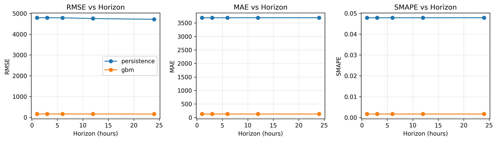

# Formal Evaluation Report

## Summary
This report summarizes forecasting performance, backtesting, and decision‑support outputs for ORIUS.

## Model Metrics (Test Split)
### load_mw
| Model | RMSE | MAE | sMAPE | MAPE |
|---|---:|---:|---:|---:|
| gbm | 182.22731815260244 | 134.31147362296937 | 0.001741370809780408 | 0.0017407105312542592 |
| lstm | 4788.956614525568 | 3773.3433424556556 | 0.04978454259318315 | 0.04878685225645898 |
| tcn | 5173.258144192 | 4062.3268569308816 | 0.05242975139080958 | 0.05317831180970469 |
| nbeats | 13112.253424427425 | 10669.134537339056 | 0.1486458453303889 | 0.13439067394675916 |
| tft | 10239.691422784752 | 8607.71188837616 | 0.11581858036875912 | 0.10803389727816028 |
| patchtst | 6653.491262062936 | 5202.627487353067 | 0.06859182485603912 | 0.0666978826307173 |

### wind_mw
| Model | RMSE | MAE | sMAPE | MAPE |
|---|---:|---:|---:|---:|
| gbm | 334.2804531884752 | 183.72711738733585 | 0.02283585708985751 | 788697459.2102427 |
| lstm | 6414.971520794806 | 5466.412275687497 | 0.45004542804416253 | 42938.183303959035 |
| tcn | 6929.7936124424195 | 5963.700701900386 | 0.47784558211812683 | 32682.86128741423 |
| nbeats | 8059.1680063909225 | 6764.5939241240785 | 0.5572118929330281 | 27211.92704758095 |
| tft | 7034.164466589556 | 6032.029942678739 | 0.4731624165330012 | 31310.19587458604 |
| patchtst | 7106.909323020893 | 6041.998645600134 | 0.48117080617072633 | 33297.56406468478 |

### solar_mw
| Model | RMSE | MAE | sMAPE | MAPE | Daylight‑MAPE |
|---|---:|---:|---:|---:|---:|
| gbm | 211.66110417074808 | 73.22261507381741 | 0.4787042843806955 | 15132125.075995194 | 0.646757497956328 |
| lstm | 1752.0542183189084 | 1087.0389181926148 | 1.3493323445975707 | 498542.10457573785 | 118.79076155703392 |
| tcn | 1636.7264067790607 | 795.286343456239 | 1.1572065954065995 | 20754.285955284628 | 7.733118720688792 |
| nbeats | 1617.5635236777766 | 983.4367736098894 | 1.355669997235998 | 407180.5912964863 | 108.6142450084102 |
| tft | 3698.5213006864365 | 2100.587034637947 | 1.8136829012711642 | 331958.05176109273 | 93.2613657224891 |
| patchtst | 1927.252965760769 | 1124.8472527115748 | 1.382972395518532 | 384926.27381613455 | 111.95941186832673 |

## Baseline Metrics (Test Split)
### load_mw
| Baseline | RMSE | MAE | sMAPE | MAPE |
|---|---:|---:|---:|---:|
| persistence_24h | 4794.5029081460025 | 3691.2984251968505 | 0.04787441385901664 | 0.04745277292198041 |
| moving_average_24h | 4658.313525154179 | 3798.4548884514443 | 0.049869783537454436 | 0.05007661316408526 |

### wind_mw
| Baseline | RMSE | MAE | sMAPE | MAPE |
|---|---:|---:|---:|---:|
| persistence_24h | 8237.891716183156 | 6656.84094488189 | 0.5395409837772438 | 11145433071.602448 |
| moving_average_24h | 5415.042819436663 | 4321.018307086614 | 0.35668633287746115 | 8108175853.476254 |

### solar_mw
| Baseline | RMSE | MAE | sMAPE | MAPE | Daylight‑MAPE |
|---|---:|---:|---:|---:|---:|
| persistence_24h | 1813.4454736293485 | 841.0779527559055 | 0.6805605015189686 | 17637796.620273266 | 1.41369788616925 |
| moving_average_24h | 3132.034953755044 | 2549.796620734908 | 1.561792529509564 | 8975049881.752747 | 703.498335966092 |

## Multi‑Horizon Backtest (Load)

## Conclusions
GBM provides a strong baseline on the OPSD data, while sequence models capture temporal structure for longer horizons. Optimization outputs are cost‑ and carbon‑aware and suitable for operator decision support.
