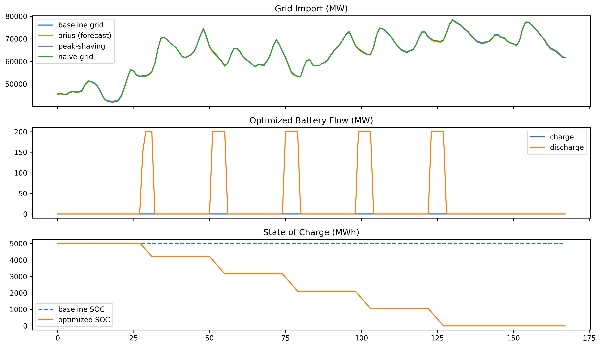

# Impact Evaluation — Baseline vs GridPulse

This report compares dispatch outcomes for the same 7‑day forecast window (selected from the test split).

- Horizon: 168 hours (7 days)
- Window index: 432–600
- Forecast source: test split (proxy for day‑ahead forecast)
- Config: `configs/optimization.yaml`

## Policy Comparison
| Policy | Cost (USD) | Carbon (kg) | Carbon Cost (USD) |
|---|---:|---:|---:|
| Grid‑only baseline | 461,364,890.00 | 3,907,803,618.32 | 195,390,180.92 |
| Naive battery | 462,821,035.03 | 3,911,194,390.28 | 195,559,719.51 |
| Peak‑shaving heuristic | 461,540,022.90 | 3,908,660,249.57 | 195,433,012.48 |
| Price‑greedy (MPC‑style) | 460,068,067.28 | 3,925,065,173.59 | 196,253,258.68 |
| GridPulse (forecast‑optimized) | 460,842,677.76 | 3,902,642,369.72 | 195,132,118.49 |
| Oracle upper bound (perfect forecast) | 460,842,677.76 | 3,902,642,369.72 | 195,132,118.49 |

## Savings vs Baseline (GridPulse vs Grid‑only)
- Cost savings: 522,212.24 (0.11%)
- Carbon reduction: 5,161,248.60 kg (0.13%)

- Carbon source used for optimization: average

## Savings vs Naive Battery (GridPulse vs Naive)
- Cost savings: 1,978,357.27 (0.43%)
- Carbon reduction: 8,552,020.55 kg (0.22%)

## Oracle Gap (GridPulse vs Perfect‑Forecast Upper Bound)
- Oracle cost: 460,842,677.76
- Gap vs oracle: 0.00

## Dispatch Comparison

## Arbitrage Logic (Level-4)

