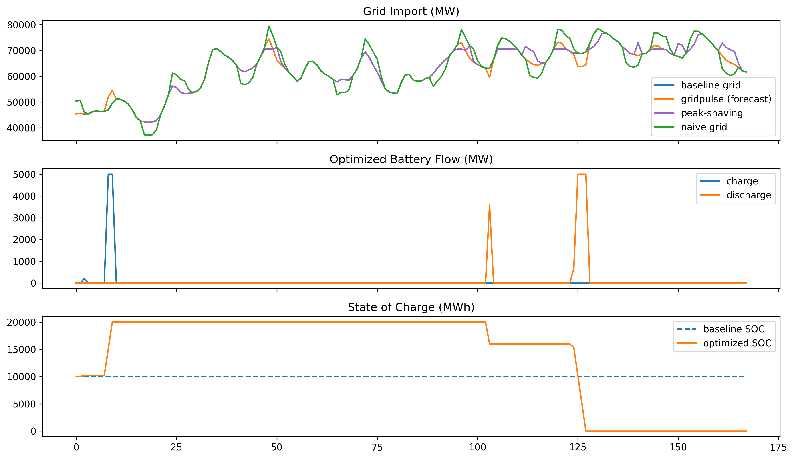
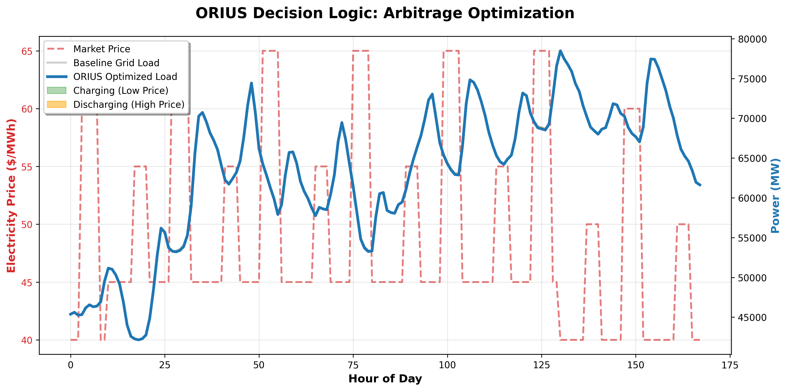

# Impact Evaluation — Baseline vs GridPulse

This report compares dispatch outcomes for the same 7‑day forecast window (selected from the test split).

- Horizon: 168 hours (7 days)
- Window index: 744–912
- Forecast source: test split (proxy for day‑ahead forecast)
- Config: `configs/optimization.yaml`

## Policy Comparison
| Policy | Cost (USD) | Carbon (kg) | Carbon Cost (USD) |
|---|---:|---:|---:|
| Grid‑only baseline | 520,523,500.00 | 4,470,300,483.57 | 223,515,024.18 |
| Naive battery | 520,517,360.81 | 4,475,197,184.82 | 223,759,859.24 |
| Peak‑shaving heuristic | 521,914,354.45 | 4,478,499,171.75 | 223,924,958.59 |
| Price‑greedy (MPC‑style) | 519,021,033.38 | 4,487,898,905.56 | 224,394,945.28 |
| GridPulse (forecast‑optimized) | 519,973,304.08 | 4,465,273,594.63 | 223,263,679.73 |
| Oracle upper bound (perfect forecast) | 519,973,304.08 | 4,465,273,594.63 | 223,263,679.73 |

## Savings vs Baseline (GridPulse vs Grid‑only)
- Cost savings: 550,195.92 (0.11%)
- Carbon reduction: 5,026,888.95 kg (0.11%)

- Carbon source used for optimization: average

## Savings vs Naive Battery (GridPulse vs Naive)
- Cost savings: 544,056.73 (0.10%)
- Carbon reduction: 9,923,590.20 kg (0.22%)

## Oracle Gap (GridPulse vs Perfect‑Forecast Upper Bound)
- Oracle cost: 519,973,304.08
- Gap vs oracle: 0.00

## Dispatch Comparison

## Arbitrage Logic (Level-4)

