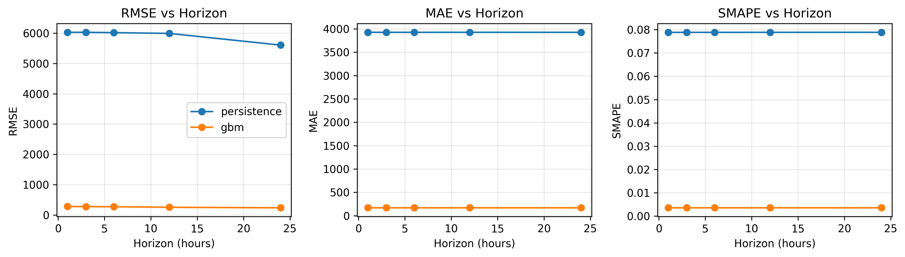

# Formal Evaluation Report

## Summary
This report summarizes forecasting performance, backtesting, and decision‑support outputs for ORIUS.

## Model Metrics (Test Split)
### load_mw
| Model | RMSE | MAE | sMAPE | MAPE |
|---|---:|---:|---:|---:|
| gbm | 265.93001899393346 | 173.24888820203043 | 0.003642035022672027 | 0.003651284512438472 |

### wind_mw
| Model | RMSE | MAE | sMAPE | MAPE |
|---|---:|---:|---:|---:|
| gbm | 177.17750007987777 | 108.20420696771001 | 0.0212260673095586 | 0.024461710483876926 |

### solar_mw
| Model | RMSE | MAE | sMAPE | MAPE | Daylight‑MAPE |
|---|---:|---:|---:|---:|---:|
| gbm | 242.8311136728299 | 122.03606588572772 | 0.6912835064209579 | 30093277.856271327 | 0.08764578744646839 |

### price_eur_mwh
| Model | RMSE | MAE | sMAPE | MAPE |
|---|---:|---:|---:|---:|
| gbm | 4.963301925932962 | 2.3025768734285337 | 0.10013370752643833 | 1.34900317514759 |

## Baseline Metrics (Test Split)
### load_mw
| Baseline | RMSE | MAE | sMAPE | MAPE |
|---|---:|---:|---:|---:|
| persistence_24h | 6027.9165370760265 | 3926.2976522085155 | 0.07885130425312796 | 0.07775592600459137 |
| moving_average_24h | 8081.41633673434 | 6811.264557633639 | 0.13411407310869267 | 0.13882396917703638 |

### wind_mw
| Baseline | RMSE | MAE | sMAPE | MAPE |
|---|---:|---:|---:|---:|
| persistence_24h | 7823.3481418906595 | 5510.391165937127 | 0.6233845918389466 | 0.8576784765434317 |
| moving_average_24h | 4973.092838685555 | 3612.115549144449 | 0.4307330960637471 | 0.5923108748055911 |

### solar_mw
| Baseline | RMSE | MAE | sMAPE | MAPE | Daylight‑MAPE |
|---|---:|---:|---:|---:|---:|
| persistence_24h | 2426.8854611997513 | 1246.7361719060884 | 0.14060981027990357 | 358137.833246327 | 0.2205576586910432 |
| moving_average_24h | 8933.132470089251 | 7873.631930627404 | 1.2936790214004685 | 239728491998.21857 | 230.30776660095552 |

## Multi‑Horizon Backtest (Load)

## Conclusions
GBM provides a strong baseline on the OPSD data, while sequence models capture temporal structure for longer horizons. Optimization outputs are cost‑ and carbon‑aware and suitable for operator decision support.
