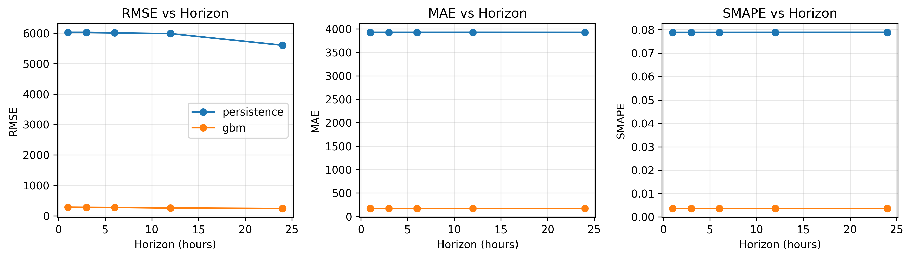

# Formal Evaluation Report

## Summary
This report summarizes forecasting performance, backtesting, and decision‑support outputs for ORIUS.

## Model Metrics (Test Split)
### load_mw
| Model | RMSE | MAE | sMAPE | MAPE |
|---|---:|---:|---:|---:|
| gbm | 254.46962225713838 | 161.00867465708384 | 0.0033757756825217385 | 0.0033841481905837485 |
| lstm | 7540.30598859217 | 6753.144443999601 | 0.12604181605591336 | 0.13659431241102682 |
| tcn | 7465.936919521333 | 6774.402330836834 | 0.1255544214783542 | 0.13603635233553443 |
| nbeats | 5080.1941530211425 | 4101.365194206555 | 0.07928563621237648 | 0.08256197147205376 |
| tft | 8958.754500685904 | 7724.4369415523415 | 0.15194873874151052 | 0.1512829275001665 |
| patchtst | 3937.978903108021 | 2993.4955676169666 | 0.05840820839884364 | 0.05676929800696147 |

### wind_mw
| Model | RMSE | MAE | sMAPE | MAPE |
|---|---:|---:|---:|---:|
| gbm | 163.48914817306778 | 102.86052052198058 | 0.0204284268558021 | 0.023346053333172554 |
| lstm | 7206.161040768951 | 5759.427354986431 | 0.6228707307505237 | 1.4210739958675964 |
| tcn | 7146.836581638908 | 5460.329094912195 | 0.6232363005626482 | 1.266063385880775 |
| nbeats | 8407.529820046046 | 6987.05633902156 | 0.7165675194463648 | 1.9090635776403615 |
| tft | 7431.098637409741 | 5518.7968627402 | 0.6353385679865271 | 1.187437166691399 |
| patchtst | 7486.27614175528 | 5723.469022711642 | 0.6516756216921 | 1.3366692238883373 |

### solar_mw
| Model | RMSE | MAE | sMAPE | MAPE | Daylight‑MAPE |
|---|---:|---:|---:|---:|---:|
| gbm | 237.6418857917526 | 119.42378315814967 | 0.6877210568332821 | 22344464.463681906 | 0.07455914199609613 |
| lstm | 2465.7634192585047 | 1408.3866157154555 | 0.9720029209289209 | 228517.6613736832 | 228517.6613736832 |
| tcn | 2875.996845535249 | 1641.823003194695 | 0.9983742337910017 | 349435.3984517865 | 349435.3984517865 |
| nbeats | 2659.431019219403 | 1561.055802777926 | 0.9629992840793087 | 503201.14508706384 | 503201.14508706384 |
| tft | 10688.387424510258 | 7327.242370331281 | 1.5915140543560389 | 4272496.698774492 | 4272496.698774492 |
| patchtst | 2792.0491472950303 | 1679.049261508398 | 0.9599064300041327 | 611399.0658693035 | 611399.0658693035 |

### price_eur_mwh
| Model | RMSE | MAE | sMAPE | MAPE |
|---|---:|---:|---:|---:|
| gbm | 4.970569083045707 | 2.324709128415382 | 0.10128157227645754 | 1.3607803456860617 |
| lstm | 11.500100502463583 | 7.3334376173462905 | 0.2445439436606471 | 4.233955035992386 |
| tcn | 12.702869755995081 | 9.121850286316334 | 0.3235227461865487 | 4.583597333444158 |
| nbeats | 13.672406301570641 | 9.920224838373514 | 0.36082087787047007 | 4.400695755806067 |
| tft | 15.78856136497114 | 10.4485000220874 | 0.3159413641625257 | 6.127846868171796 |
| patchtst | 13.515091520714082 | 8.67860255003015 | 0.2697055239261668 | 5.808159630143105 |

## Baseline Metrics (Test Split)
### load_mw
| Baseline | RMSE | MAE | sMAPE | MAPE |
|---|---:|---:|---:|---:|
| persistence_24h | 6027.9165370760265 | 3926.2976522085155 | 0.07885130425312796 | 0.07775592600459137 |
| moving_average_24h | 8081.41633673434 | 6811.264557633639 | 0.13411407310869267 | 0.13882396917703638 |

### wind_mw
| Baseline | RMSE | MAE | sMAPE | MAPE |
|---|---:|---:|---:|---:|
| persistence_24h | 7823.3481418906595 | 5510.391165937127 | 0.6233845918389466 | 0.8576784765434317 |
| moving_average_24h | 4973.092838685555 | 3612.115549144449 | 0.4307330960637471 | 0.5923108748055911 |

### solar_mw
| Baseline | RMSE | MAE | sMAPE | MAPE | Daylight‑MAPE |
|---|---:|---:|---:|---:|---:|
| persistence_24h | 2426.8854611997513 | 1246.7361719060884 | 0.14060981027990357 | 358137.833246327 | 0.2205576586910432 |
| moving_average_24h | 8933.132470089251 | 7873.631930627404 | 1.2936790214004685 | 239728491998.21857 | 230.30776660095552 |

## Multi‑Horizon Backtest (Load)

## Conclusions
GBM provides a strong baseline on the OPSD data, while sequence models capture temporal structure for longer horizons. Optimization outputs are cost‑ and carbon‑aware and suitable for operator decision support.
