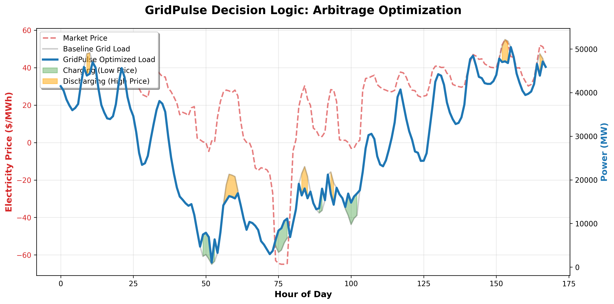

# Impact Evaluation — Baseline vs GridPulse

This report compares dispatch outcomes for the same 7‑day forecast window (selected from the test split).

- Horizon: 168 hours (7 days)
- Window index: 456–624
- Forecast source: test split (proxy for day‑ahead forecast)
- Config: `configs/optimization.yaml`

## Policy Comparison
| Policy | Cost (USD) | Carbon (kg) | Carbon Cost (USD) |
|---|---:|---:|---:|
| Grid‑only baseline | 154,773,462.72 | 1,461,641,243.28 | 73,082,062.16 |
| Naive battery | 154,200,945.64 | 1,454,657,899.03 | 72,732,894.95 |
| Peak‑shaving heuristic | 155,096,309.40 | 1,465,616,652.67 | 73,280,832.63 |
| Price‑greedy (MPC‑style) | 154,098,659.76 | 1,457,458,733.64 | 72,872,936.68 |
| GridPulse (forecast‑optimized) | 144,129,302.89 | 1,459,870,646.53 | 72,993,532.33 |
| Risk‑aware (interval) | 148,233,859.52 | 1,506,396,539.25 | 75,319,826.96 |
| Oracle upper bound (perfect forecast) | 152,331,496.60 | 1,451,467,789.95 | 72,573,389.50 |

## Savings vs Baseline (GridPulse vs Grid‑only)
- Cost savings: 10,644,159.83 (6.88%)
- Carbon reduction: 1,770,596.75 kg (0.12%)

- Carbon source used for optimization: average

## Savings vs Naive Battery (GridPulse vs Naive)
- Cost savings: 10,071,642.75 (6.53%)
- Carbon reduction: -5,212,747.50 kg (-0.36%)

## Oracle Gap (GridPulse vs Perfect‑Forecast Upper Bound)
- Oracle cost: 152,331,496.60
- Gap vs oracle: -8,202,193.71

## Dispatch Comparison

## Arbitrage Logic (Level-4)

