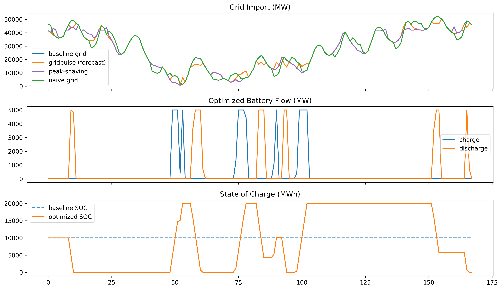
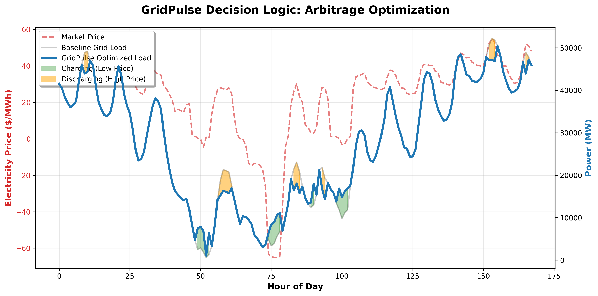

# Impact Evaluation — Baseline vs ORIUS

This report compares dispatch outcomes for the same 7‑day forecast window (selected from the test split).

- Horizon: 168 hours (7 days)
- Window index: 360–528
- Forecast source: test split (proxy for day‑ahead forecast)
- Config: `configs/optimization.yaml`

## Policy Comparison
| Policy | Cost (USD) | Carbon (kg) | Carbon Cost (USD) |
|---|---:|---:|---:|
| Grid‑only baseline | 155,149,015.93 | 1,798,244,455.25 | 89,912,222.76 |
| Naive battery | 155,133,643.93 | 1,798,360,428.37 | 89,918,021.42 |
| Peak‑shaving heuristic | 155,141,146.65 | 1,798,897,403.45 | 89,944,870.17 |
| Price‑greedy (MPC‑style) | 154,660,436.54 | 1,796,900,267.50 | 89,845,013.38 |
| ORIUS (forecast‑optimized) | 138,623,678.06 | 1,858,399,454.38 | 92,919,972.72 |
| Risk‑aware (interval) | 141,534,329.78 | 1,915,841,202.73 | 95,792,060.14 |
| Oracle upper bound (perfect forecast) | 154,760,487.68 | 1,795,509,121.18 | 89,775,456.06 |

## Savings vs Baseline (ORIUS vs Grid‑only)
- Cost savings: 16,525,337.87 (10.65%)
- Carbon reduction: -60,154,999.13 kg (-3.35%)

- Carbon source used for optimization: average

## Savings vs Naive Battery (ORIUS vs Naive)
- Cost savings: 16,509,965.87 (10.64%)
- Carbon reduction: -60,039,026.00 kg (-3.34%)

## Oracle Gap (ORIUS vs Perfect‑Forecast Upper Bound)
- Oracle cost: 154,760,487.68
- Gap vs oracle: -16,136,809.62

## Dispatch Comparison

## Arbitrage Logic (Level-4)

